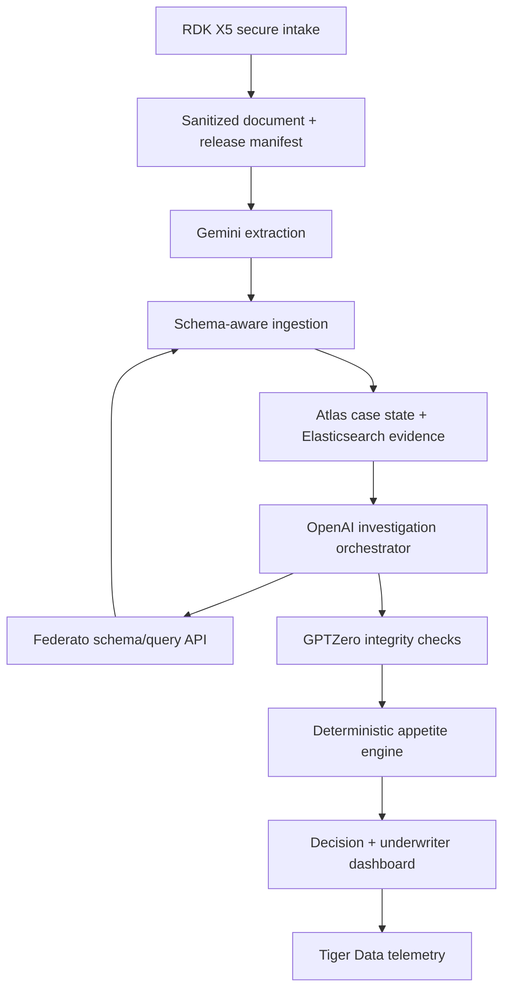
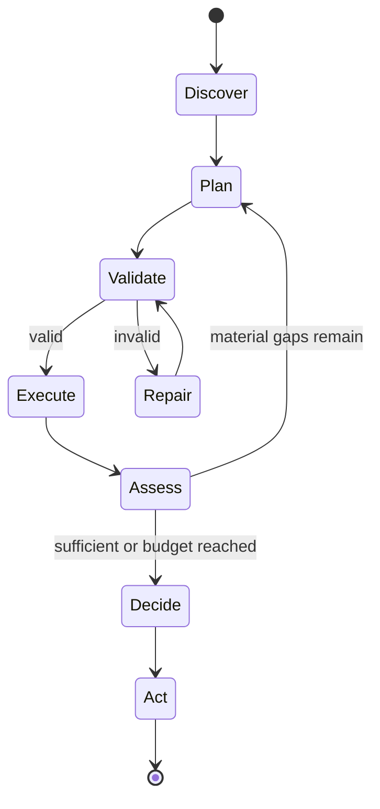
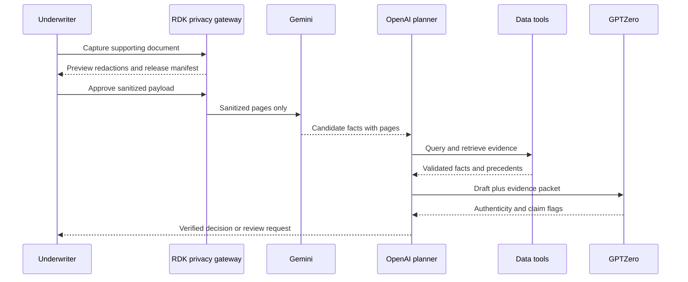

# Lloyd / RiskGraph: Privacy-Preserving Underwriting Investigation and Triage

## Technical Design Document

**Hackathon targets:** Federato Insurance Agent, Elastic Find the Signal, MongoDB Atlas, GPTZero, Google Gemini API, OpenAI API + Codex, Tiger Data  
**Supporting technology:** D-Robotics RDK X5 edge privacy gateway; optional Backboard memory  
**Status:** Implementation-ready draft, updated for parallel Codex/Cursor implementation  
**Scope:** Commercial property submission triage using the Federato Hack the North 2026 dataset

---

## 1. Executive Summary

Lloyd, internally referred to as RiskGraph in service and collection names, is an underwriting investigation agent that dynamically discovers Federato's data schema, constructs and executes valid queries, evaluates commercial property submissions against carrier appetite, and ranks the queue with evidence-backed explanations. An RDK X5 acts as a privacy-preserving intake appliance: it captures paper documents, performs local OCR and sensitive-field detection, and releases only an approved sanitized derivative to cloud services.

The system is deliberately more than a retrieval chatbot:

1. It inspects the runtime schema instead of assuming field names.
2. It plans the minimum queries needed to evaluate the carrier's appetite.
3. It validates generated queries before execution.
4. It adapts when results are empty, incomplete, or contradictory.
5. It uses Elasticsearch as an evidence and retrieval layer over messy text and risk observations.
6. It uses MongoDB Atlas as persistent case state and vector-based institutional memory.
7. It produces an auditable decision, ranked work queue, missing-information requests, and a "Path to Yes."
8. It uses Gemini to extract structured underwriting facts from uploaded PDFs, scans, and tables.
9. It uses GPTZero to investigate the authenticity of inbound narratives and check the agent's final claims for hallucination or weak support.
10. It uses the OpenAI Responses API as the runtime investigation planner that chooses tools and returns schema-constrained plans.
11. It uses Tiger Data for append-only operational telemetry and continuous aggregates without duplicating MongoDB case state.
12. It optionally uses Backboard only for approved, non-case-specific underwriter preferences and corrections.
13. It treats the RDK X5 as an edge privacy gateway rather than attempting to run the full underwriting agent locally.

The core demo follows one submission from initial intake through investigation. A submission that appears attractive is downgraded when the agent finds missing or contradictory risk evidence, then upgraded to "Accept with Conditions" after a simulated broker response resolves the decisive uncertainty.

### 1.1 Product promise

> RiskGraph tells an underwriter which submissions deserve attention, why they fit or fail appetite, what evidence is missing, and the shortest path to an actionable decision.

### 1.2 Design principle

Deterministic code owns privacy policy enforcement, eligibility, scoring, query validation, and audit trails. The RDK X5 owns local capture, OCR preprocessing, sensitive-data detection, redaction, tokenization, and release approval. Gemini owns cloud multimodal extraction from sanitized artifacts. OpenAI owns investigation planning, tool selection, counterfactual reasoning, and plain-English synthesis. GPTZero owns independent content-authenticity and hallucination signals. No model may silently invent missing underwriting facts, expose a local-only value, or override hard appetite rules.

---

## 2. Source-of-Truth Requirements

This design is grounded in the supplied Federato package:

- `STUDENT_PROJECT_GUIDELINES.pdf`
- `API_DOCUMENTATION.pdf`
- `QUERY_REQUEST_BODY.pdf`
- `DATA_SCHEMA.pdf`
- `APPETITE_GUIDELINES.pdf`
- `GLOSSARY.pdf`
- `README.txt`

### 2.1 Confirmed Federato API contract

| Item | Requirement |
|---|---|
| Token endpoint | `POST https://auth.product.federato.ai/oauth/token` |
| OAuth grant | `client_credentials` |
| Audience | `https://product.federato.ai/core-api` |
| Token lifetime | 14,400 seconds / 4 hours |
| Data endpoint | `POST https://product.federato.ai/integrations-api/handlers/federato-hack-north?outputOnly=true` |
| Supported actions | `schema`, `query` |
| Schema request | `{ "action": "schema" }` |
| Query request | `{ "action": "query", "payload": { ... } }` |
| Output mode | Use `outputOnly=true` to avoid the workflow envelope |

The authentication domain is not interchangeable with the API domain. Tokens must be minted from `auth.product.federato.ai`. The backend verifies the JWT issuer and audience during development and refreshes the token before expiration.

### 2.2 Confirmed query pipeline

Federato executes query stages in this order:

```text
where -> expand -> unwind -> filter -> over -> select -> sort -> paginate
```

Consequences:

- `where` filters raw records before reference hydration.
- `expand` is required when a downstream stage needs fields from a referenced resource.
- `filter` operates after expansion.
- Array boundaries require `$elemMatch`; dot paths do not automatically traverse arrays.
- `sort` runs after `select`, so it may use derived fields.
- `total` is the total number of matches independent of pagination.

Supported filter operators are `$eq`, `$ne`, `$exists`, `$gt`, `$gte`, `$lt`, `$lte`, `$in`, `$nin`, `$contains`, and `$elemMatch`, plus `$and`, `$or`, and `$not`. Supported reductions are `$sum`, `$avg`, `$min`, `$max`, `$count`, and `$countDistinct`.

### 2.3 Runtime schema discovery is mandatory

The supplied `DATA_SCHEMA.pdf` intentionally does not provide a complete field catalog. At startup, RiskGraph calls the schema action and derives:

- Available resources
- Scalar, object, array, and reference fields
- Reference targets
- Reference cardinality (`one` or `many`)
- Legal traversal paths
- Array boundaries that require `$elemMatch` or `unwind`

No production query may depend solely on a field name copied from an example. Example resources such as `Policy`, `Location`, `insured`, `exposure_units`, and `buildings` are treated as hints until verified against the returned schema.

---

## 3. Goals and Non-Goals

### 3.1 Goals

- Process and rank all 50+ synthetic commercial insurance submissions.
- Dynamically map the discovered schema to the data required by the appetite guidelines.
- Generate valid Federato queries from investigation goals.
- Score every submission deterministically and expose every contributing factor.
- Distinguish target, acceptable, not acceptable, missing, boundary, and contradictory data.
- Use hybrid retrieval over unstructured evidence rather than vector-only RAG.
- Retrieve semantically similar historical cases as underwriting precedents.
- Allow an underwriter to run counterfactuals and see the decision recalculate.
- Produce a concise broker information request for unresolved facts.
- Continue with partial results when enrichment or vector services are unavailable.
- Apply configurable document-authenticity policies to underwriting narratives and supporting reports.
- Verify the agent's final recommendation narrative against its cited evidence before display.
- Demonstrate local-first camera intake that prevents unnecessary sensitive data from reaching cloud providers.
- Produce privacy-safe operational analytics without duplicating case state.

### 3.2 Non-goals

- Binding or issuing a real insurance policy
- Replacing a licensed underwriter
- Predicting technically adequate premium or expected loss
- Claiming that public web data is authoritative without provenance
- Supporting every line of business during the hackathon
- Building a general-purpose autonomous web browser
- Hardcoding every Federato query or every runtime schema path
- Treating an AI-detection score as conclusive proof of authorship or fraud
- Using multiple model providers for the same undifferentiated task
- Running the full underwriting agent or a required LLM on the RDK X5
- Treating encryption, hashing, or embeddings as automatic anonymization
- Adding RunPod or Vultr without a measured compute requirement
- Making a 3D embedding visualization part of the critical decision path

---

## 4. User Experience

### 4.1 Primary workflow

1. The underwriter opens the ranked submission queue.
2. RiskGraph displays `In Appetite`, `Investigate`, and `Out of Appetite` lanes.
3. Each row shows score, premium, TIV, state, decisive factors, and confidence.
4. Opening a case reveals a criterion-by-criterion appetite matrix.
5. The underwriter expands any finding to see its source, query, rule, and timestamp.
6. The agent proposes missing-information questions and the shortest "Path to Yes."
7. The underwriter enters a hypothetical answer or broker response.
8. Only affected rules are reevaluated and the decision history records the change.

### 4.2 Queue row

```text
#1  Acme Industrial LLC             91 / 100   IN APPETITE
    $84K premium | $72M TIV | PA | New business
    Target premium and TIV; post-2010 masonry construction; low five-year losses
```

### 4.3 Case view

The case view has four zones:

- **Decision header:** recommendation, score, confidence, premium opportunity
- **Appetite matrix:** each rule, observed value, classification, and evidence
- **Evidence timeline:** Federato facts, retrieved document passages, enrichments, and conflicts
- **Action panel:** request information, simulate a change, or mark for review

### 4.4 Required evidence labels

Every displayed finding is labeled as one of:

- `VERIFIED`: directly returned by Federato or a cited authoritative source
- `INFERRED`: derived from one or more facts, with the derivation shown
- `CONTRADICTED`: two sources disagree
- `UNKNOWN`: required evidence is absent
- `STALE`: evidence exists but is outside its configured freshness window

---

## 5. Appetite Model

### 5.1 Required inputs

The provided appetite document requires:

- Account name
- Primary risk state
- Line of business
- Effective and expiration dates
- Total insured value (TIV)
- Construction type
- Building year
- Total premium
- Five-year loss history
- Submission type

The schema mapper must locate these concepts in the runtime schema. If a concept cannot be mapped confidently, the system marks it unresolved and asks the planner for a narrower discovery query or the user for confirmation.

### 5.2 Rule table

| Factor | Target | Acceptable | Not acceptable |
|---|---|---|---|
| Submission type | — | New business | Renewal business |
| Line of business | — | Property | Any other line |
| Primary risk state | OH, PA, MD, CO, CA, FL | OH, PA, MD, CO, CA, FL, NC, SC, GA, VA, UT | Any other state |
| TIV | $50M-$100M | Up to $150M | Over $150M |
| Total premium | $75K-$100K | $50K-$175K | Under $50K or over $175K |
| Building age | Newer than 2010 | Newer than 1990 | Older than 1990 |
| Construction | — | More than 50% joisted masonry, non-combustible/steel, or masonry non-combustible | More than 50% other construction |
| Five-year loss value | — | Under $100K | Over $100K |

The source leaves exact-boundary cases ambiguous for building year 1990 and loss value $100,000. RiskGraph must classify these as `BOUNDARY_REVIEW`, not invent a favorable interpretation. Product ranges that explicitly say "up to" are inclusive; target range endpoints are treated as inclusive.

### 5.3 Deterministic classification

Each criterion returns:

```typescript
type CriterionStatus =
  | "TARGET"
  | "ACCEPTABLE"
  | "NOT_ACCEPTABLE"
  | "UNKNOWN"
  | "CONTRADICTED"
  | "BOUNDARY_REVIEW";
```

Overall recommendation:

1. `OUT_OF_APPETITE` if any verified criterion is `NOT_ACCEPTABLE`.
2. `INVESTIGATE` if there are no verified failures but at least one required criterion is `UNKNOWN`, `CONTRADICTED`, or `BOUNDARY_REVIEW`.
3. `IN_APPETITE` if every required criterion is `TARGET` or `ACCEPTABLE`.
4. `ACCEPT_WITH_CONDITIONS` may be shown only when a human-entered or verified counterfactual resolves all hard failures but operational conditions remain.

This decision is not delegated to the LLM.

### 5.4 Transparent queue score

The decision class is primary; the numeric score ranks cases within and across lanes.

| Criterion | Weight |
|---|---:|
| Submission type | 10 |
| Line of business | 15 |
| Primary state | 10 |
| TIV | 15 |
| Premium | 15 |
| Building year | 10 |
| Construction mix | 10 |
| Five-year loss value | 15 |
| **Total** | **100** |

Status multipliers:

| Status | Multiplier |
|---|---:|
| Target | 1.00 |
| Acceptable | 0.80 |
| Boundary review | 0.45 |
| Unknown | 0.35 |
| Contradicted | 0.20 |
| Not acceptable | 0.00 |

```text
appetite_score = sum(weight_i * multiplier(status_i))
```

The UI must never imply that a high score cancels a hard failure. A case with one hard failure can score highly but remains `OUT_OF_APPETITE`.

### 5.5 Ranking formula

```text
priority_score =
    0.70 * appetite_score
  + 0.15 * completeness_score
  + 0.10 * opportunity_score
  + 0.05 * freshness_score
```

- `completeness_score`: percentage of required guideline inputs supported by verified evidence.
- `opportunity_score`: normalized premium desirability within the documented appetite, not a profitability estimate.
- `freshness_score`: recency of submission and supporting evidence when dates exist.

Lane ordering precedes numeric sorting:

1. In appetite
2. Investigate
3. Out of appetite

Within `Investigate`, prioritize high-value cases that can be resolved with the fewest information requests.

### 5.6 Multi-building aggregation assumptions

Until the runtime schema and sample records confirm semantics:

- TIV is summed across relevant property exposure units/buildings unless a verified policy-level TIV exists.
- Construction mix is weighted by building TIV, not building count.
- Five-year loss value is the sum of the applicable loss amount field for losses within the five years preceding the proposed effective date.
- Missing TIV on a building prevents a confident construction-weight calculation.

These assumptions must be visible in the audit record and easy to change in configuration.

### 5.7 Configurable document-authenticity policy

The supplied Federato 2025 appetite guidelines do **not** contain an AI-authorship rule. RiskGraph supports an additional versioned carrier policy pack so the demo can add a rule such as:

```yaml
document_authenticity:
  applies_to:
    - broker_narrative
    - inspection_report
    - engineering_report
  requirement: human_authored_or_disclosed
  review_threshold: <configured_from_GPTZero_response>
  on_detection: investigate
  on_verified_violation: not_acceptable
```

Interpretation:

- A GPTZero signal above the configured review threshold creates an `AUTHENTICITY_REVIEW` finding and moves the case to `INVESTIGATE`.
- It does not automatically accuse the broker of fraud or mark the submission out of appetite.
- The UI highlights the specific document and passages requiring confirmation.
- If the broker discloses permitted AI assistance, the carrier policy determines whether that resolves the finding.
- A hard `NOT_ACCEPTABLE` result requires the policy's stated verification procedure or human confirmation, not the detector score alone.

This separation preserves the original Federato appetite evaluation while demonstrating how a carrier can introduce authenticity requirements without rewriting the scoring engine.

---

## 6. System Architecture



### 6.1 Component responsibilities

#### Federato API

Authoritative source for dataset resources, relationships, submissions/policies, exposures, buildings, premium, and loss information available in the challenge dataset.

#### Elasticsearch

Evidence-level context layer optimized for:

- BM25 exact matching
- Dense semantic retrieval
- Hybrid fusion and reranking
- Time filtering
- Geographic filtering when coordinates are available
- Aggregations and ES|QL investigations
- Traceable guideline and evidence chunks

#### MongoDB Atlas

Durable application and institutional-memory layer containing:

- Canonical normalized case snapshots
- Criterion evaluations
- Investigation state
- Similar-case vectors
- Human corrections
- Counterfactual versions
- Generated actions
- Audit events

#### RDK X5 privacy gateway

The edge device is the only component allowed to receive an unredacted camera capture by default. It performs document boundary detection, perspective correction, blur/glare checks, OCR, deterministic sensitive-pattern detection, optional lightweight NER/vision detection, and visible redaction. It stores the original and case-scoped token map locally with encryption and a short retention policy. It releases a sanitized derivative only after the policy engine and, when necessary, a user approve it.

The MVP does not depend on a local generative model. A small quantized local model may propose additional sensitive spans behind a feature flag, but it may only add redactions; it cannot unredact data or make underwriting decisions.

#### Investigation orchestrator

Uses the OpenAI Responses API with function calling and Structured Outputs to plan data requests, invoke approved tools, evaluate whether evidence is sufficient, and stop when it reaches a decision or a bounded investigation limit. Every proposed Federato query still passes through deterministic validation before execution.

#### Gemini extraction service

Processes supplemental underwriting PDFs and scans that are not represented in the structured Federato dataset. It returns schema-constrained candidate facts, document type, page references, tables, and exact supporting excerpts. Candidate facts remain unverified until deterministic checks and provenance storage complete.

#### GPTZero integrity service

Scans sufficiently substantial inbound narrative text for AI-authorship signals and checks the agent's final recommendation for hallucinated or weakly supported claims. Its output is stored as evidence with model/version metadata and is treated as a review signal, never unquestionable ground truth.

#### Appetite engine

Pure deterministic functions that calculate criterion states, decisions, and scores from normalized facts.

#### Tiger Data

Append-only operational analytics store for investigation events, model latency, OCR/redaction confidence, provider failures, decision transitions, and human overrides. Continuous aggregates power the demo analytics dashboard. Tiger Data never stores raw documents, raw prompts, OCR bodies, case token maps, or customer identifiers. MongoDB remains the application system of record, so the two databases do not conflict.

#### Backboard

Optional memory for explicit, human-approved underwriting preferences such as preferred explanation style, recurring review instructions, and corrections that should apply to future investigations. It never stores raw submissions, claimant information, case-specific narratives, credentials, or canonical decisions. If Backboard is unavailable, core underwriting behavior is unchanged.

### 6.2 Compute and hosting decision

- Do not add RunPod or Vultr for the MVP. Federato access, managed data services, hosted model APIs, a normal application host, and the RDK X5 are sufficient.
- Add external compute only if measured workloads cannot meet the demo latency target, not merely to claim another integration.
- Keep OCR and privacy preprocessing functional on the RDK CPU first; accelerate supported detector stages on the BPU only after correctness is established.
- Cloud models receive only purpose-limited sanitized payloads. The RDK does not attempt to replace Gemini or OpenAI.

---

## 7. Why Both Vector Systems Exist

Using two vector-capable systems is justified only if retrieval units and responsibilities differ.

### 7.1 Elasticsearch: evidence retrieval

Elasticsearch stores small, source-faithful chunks:

- Appetite clauses
- Submission text fragments
- Broker messages
- Loss descriptions
- Inspection notes
- External risk observations
- Agent-generated search summaries linked to their underlying evidence

It answers: **"What evidence is relevant to this question?"**

Every chunk also stores lexical text, metadata, timestamps, and provenance so the agent can combine semantic similarity with exact insurance terms, filters, geography, and recency.

### 7.2 MongoDB Atlas: precedent retrieval

Atlas stores one embedding per normalized case version. The embedded text is a compact, stable summary of exposures, appetite results, unresolved questions, final decision, and human rationale.

It answers: **"What comparable cases have we seen, and how were they handled?"**

### 7.3 No silent duplication

- Raw evidence text lives in Elasticsearch with a source pointer.
- Current normalized case state lives in Atlas.
- Federato remains authoritative for original structured records.
- Atlas case vectors do not replace Elasticsearch chunks.
- Elasticsearch evidence vectors do not become the system of record for decisions.

### 7.4 Model responsibility boundary

| Service | Exclusive runtime responsibility | Explicitly does not do |
|---|---|---|
| RDK X5 | Capture, image cleanup, OCR preprocessing, sensitive-field detection, redaction/tokenization, and outbound release enforcement | Make appetite decisions or run the primary investigation planner |
| Gemini API | Multimodal extraction from PDFs/scans/tables into candidate underwriting facts with page provenance | Decide appetite, plan Federato queries, or write final recommendations |
| OpenAI API | Plan investigations, select tools, compare evidence, generate counterfactual plans, and synthesize cited explanations | Parse raw PDFs or determine whether prose is AI-generated |
| GPTZero API | Detect likely AI-generated inbound prose and identify hallucinated/unsupported claims in generated output | Extract insurance fields, rank the queue, or make final eligibility decisions |
| Tiger Data | Store pseudonymous operational events and compute time-series aggregates | Store raw submissions, prompts, evidence text, or canonical case state |
| Backboard | Recall explicitly approved cross-case working preferences | Store submission identities, facts, evidence, or final decisions |
| Deterministic application code | Validate queries, normalize units, apply appetite thresholds, calculate scores, and enforce action permissions | Perform semantic interpretation beyond encoded rules |
| Codex | Development-time teammate for implementation, test generation, debugging, and documented iteration | Participate in production underwriting decisions |

The product should visibly expose this separation in its investigation trace so each sponsor integration is necessary rather than decorative.

### 7.5 Optional precedent map

The case view may include an expandable **Explore Similar Risks** visualization if the core workflow is already stable:

- Each node is a normalized historical case version, not an arbitrary document chunk.
- Atlas Vector Search computes nearest neighbors in the original embedding space.
- Lines connect the selected case to its top three to five cosine-nearest precedents.
- PCA or UMAP coordinates are used only for approximate 2D/3D layout.
- K-means may color broad clusters, but cluster membership is not presented as proof of similarity.
- Color represents final appetite outcome; node details show shared factors, material differences, decision, and human rationale.
- The visualization must state that projected distance is approximate and never overrides current appetite rules.

This feature is polish, not a launch dependency. A ranked similar-cases panel is the fallback if an interactive 3D view would threaten the vertical slice.

---

## 8. Data Models

### 8.1 MongoDB `cases`

```json
{
  "_id": "case:<federato-id>",
  "federatoResource": "<runtime-discovered-resource>",
  "federatoId": "<id>",
  "schemaHash": "sha256:<hash>",
  "sourceFetchedAt": "2026-09-19T15:00:00Z",
  "account": {
    "name": "Example Manufacturing",
    "submissionType": "new_business",
    "lineOfBusiness": "property",
    "effectiveDate": "2026-10-01",
    "expirationDate": "2027-10-01"
  },
  "normalizedRisk": {
    "primaryState": "PA",
    "tiv": 72000000,
    "premium": 84000,
    "buildingYear": 2016,
    "acceptableConstructionPctByTiv": 0.82,
    "fiveYearLossValue": 24000
  },
  "fieldProvenance": {
    "normalizedRisk.tiv": [
      { "source": "federato", "resource": "Policy", "path": "...", "queryId": "qry_123" }
    ]
  },
  "documentIntegrity": {
    "policy": "human_authored_or_disclosed",
    "status": "AUTHENTICITY_REVIEW",
    "documentsScanned": 2,
    "findings": ["integrity:gptzero:report-7"]
  },
  "decision": {
    "class": "IN_APPETITE",
    "appetiteScore": 96,
    "priorityScore": 91,
    "confidence": 0.94,
    "criteria": []
  },
  "unresolvedQuestions": [],
  "caseSummary": "New property business in PA...",
  "caseEmbedding": [0.012, -0.043, 0.119],
  "embeddingModel": "<configured-model>",
  "version": 3,
  "createdAt": "2026-09-19T15:00:00Z",
  "updatedAt": "2026-09-19T15:03:00Z"
}
```

### 8.2 MongoDB `investigations`

```json
{
  "_id": "inv_123",
  "caseId": "case:42",
  "status": "completed",
  "goal": "Evaluate commercial property appetite",
  "steps": [
    {
      "sequence": 1,
      "reason": "Locate property exposures and buildings",
      "tool": "federato_query",
      "queryId": "qry_123",
      "resultCount": 4,
      "startedAt": "...",
      "completedAt": "..."
    }
  ],
  "stopReason": "all_required_criteria_resolved",
  "tokenAndCostMetadata": {},
  "createdAt": "..."
}
```

### 8.3 MongoDB `actions`

```json
{
  "_id": "act_123",
  "caseId": "case:42",
  "type": "REQUEST_INFORMATION",
  "status": "DRAFT",
  "questions": [
    "Please provide the current five-year loss runs.",
    "Please confirm the construction composition by insured value."
  ],
  "rationale": ["loss_history_unknown", "construction_mix_unknown"],
  "createdBy": "agent",
  "approvedBy": null,
  "createdAt": "..."
}
```

The hackathon build drafts actions but does not send external messages without explicit human approval.

### 8.4 Elasticsearch `risk-evidence-v1`

```json
{
  "evidence_id": "ev_123",
  "case_id": "case:42",
  "source_type": "federato_submission",
  "source_uri": "federato://Policy/42",
  "source_field": "<runtime-path>",
  "title": "Construction details",
  "text": "Masonry non-combustible construction...",
  "dense_vector": [0.012, -0.043, 0.119],
  "observed_at": "2026-09-19T15:00:00Z",
  "effective_at": "2026-10-01T00:00:00Z",
  "location": { "lat": 39.95, "lon": -75.16 },
  "reliability": 1.0,
  "verification_status": "VERIFIED",
  "content_hash": "sha256:<hash>",
  "metadata": {
    "resource": "Policy",
    "record_id": "42",
    "schema_hash": "sha256:<hash>"
  }
}
```

### 8.5 Elasticsearch `appetite-clauses-v1`

Each guideline is split into an atomic clause rather than arbitrary token-sized chunks:

```json
{
  "clause_id": "property.total_premium.acceptable.2025",
  "factor": "total_premium",
  "classification": "ACCEPTABLE",
  "text": "Total premium from $50,000 through $175,000 is acceptable.",
  "structured_rule": {
    "operator": "between_inclusive",
    "lower": 50000,
    "upper": 175000,
    "currency": "USD"
  },
  "dense_vector": [],
  "source_document": "APPETITE_GUIDELINES.pdf",
  "guideline_version": "2025"
}
```

### 8.6 Audit invariants

- Every normalized fact has at least one provenance pointer.
- Every criterion references the exact normalized fact and appetite clause used.
- Every agent query stores its purpose, validated payload hash, result count, and timestamp.
- Every decision change produces a new version; old versions are retained.
- Human overrides require a reason and never rewrite the original agent recommendation.
- Every Gemini-extracted fact retains document ID, page, excerpt, and extraction schema version.
- Every GPTZero result retains the scanned content hash, API/model version when returned, timestamp, and applicable carrier-policy version.
- The final recommendation stores both the pre-check draft and post-check approved narrative so hallucination corrections are demonstrable.

### 8.7 Privacy release manifest

Every camera scan or uploaded document produces a manifest that travels with the sanitized derivative:

```json
{
  "documentId": "doc_123",
  "sourceHash": "sha256:<local-original-hash>",
  "sanitizedHash": "sha256:<released-artifact-hash>",
  "classifications": {
    "redacted": ["signature", "government_id"],
    "tokenized": ["person_name", "policy_number"],
    "generalized": ["date_of_birth", "home_address"],
    "cloudAllowed": ["state", "tiv", "construction_type", "year_built"]
  },
  "destinations": {
    "gemini": ["redacted_page_2"],
    "openai": ["normalized_risk_facts"],
    "gptzero": ["redacted_narrative"]
  },
  "redactionConfidence": 0.97,
  "approvedBy": "user-or-policy",
  "approvedAt": "2026-09-19T15:00:00Z",
  "localRetentionUntil": "2026-09-20T15:00:00Z"
}
```

The local token map is deliberately excluded. The server rejects artifacts without a manifest, with a mismatched sanitized hash, or with confidence below policy unless explicit human approval is recorded.

### 8.8 Tiger Data event schema

```sql
CREATE TABLE investigation_events (
  occurred_at timestamptz NOT NULL,
  investigation_id text NOT NULL,
  pseudonymous_case_id text NOT NULL,
  event_type text NOT NULL,
  component text NOT NULL,
  duration_ms integer,
  confidence double precision,
  status text NOT NULL,
  metadata jsonb NOT NULL DEFAULT '{}'::jsonb
);
```

Convert the table to a hypertable and define continuous aggregates for hourly throughput, median investigation duration, provider error rate, redaction counts, and human-override rate. `metadata` is allowlisted and must never include raw text, prompts, addresses, tokens, or unredacted values.

---

## 9. Schema Intelligence

### 9.1 Schema graph

The schema service converts the response into an internal graph:

```typescript
interface SchemaNode {
  resource: string;
  path: string;
  type: "object" | "array" | "reference" | "string" | "number" | "boolean" | string;
  itemType?: string;
  targetResource?: string;
  cardinality?: "one" | "many";
  children?: string[];
}
```

It derives:

- `legalPaths(resource)`
- `arrayBoundaries(path)`
- `referenceChain(path)`
- `requiredExpansions(path)`
- `candidatePaths(concept)`

### 9.2 Concept mapper

The mapper receives the runtime schema plus the underwriting glossary and returns ranked candidates for each required concept.

```json
{
  "concept": "five_year_loss_value",
  "candidates": [
    {
      "resource": "<resource>",
      "path": "<path>",
      "confidence": 0.91,
      "rationale": "Numeric loss amount reachable from policy through claims"
    }
  ]
}
```

Mappings above a configured threshold may be used after structural validation. Ambiguous mappings are confirmed by sampling records. The mapping and schema hash are cached so the agent does not rediscover the same paths for every case.

### 9.3 Query validator

Before any Federato query is executed, deterministic validation checks:

- `resource` exists.
- Every `where`, `filter`, `select`, `sort`, `over`, and `unwind` path exists at the stage where it is referenced.
- Every operator is supported and compatible with the field type.
- Array traversal uses `$elemMatch` or a prior `unwind`.
- Referenced fields used downstream have a corresponding `expand`.
- Expansion chains match reference targets and cardinalities.
- Pagination limits remain within configured bounds.
- Queries do not fetch the whole dataset when a projection is sufficient.

If invalid, the validator returns repair hints to the planner. It never sends a knowingly invalid query.

---

## 10. Federato API Client

### 10.1 Authentication

```typescript
interface TokenState {
  accessToken: string;
  expiresAtMs: number;
}
```

- Credentials remain server-side in environment variables.
- Refresh five minutes before the decoded JWT expiry.
- Deduplicate concurrent refreshes with a single in-flight promise.
- Verify `iss` and `aud` during development.
- Never log the secret or access token.

### 10.2 Client methods

```typescript
getSchema(forceRefresh?: boolean): Promise<FederatoSchema>
runQuery(payload: FederatoQuery): Promise<FederatoQueryResult>
```

### 10.3 Error normalization

The API may return errors as plain messages even when the underlying error includes a code. Normalize:

```typescript
interface FederatoError {
  category: "AUTH" | "VALIDATION" | "ROUTING" | "NETWORK" | "UNKNOWN";
  message: string;
  retriable: boolean;
  details?: unknown;
}
```

Handling:

- `401`: refresh once, then fail closed.
- `301`: treat as endpoint configuration error; do not rely on implicit POST redirect behavior.
- `404`: show the configured handler path in diagnostics.
- Validation error: parse the prefix/details when possible and return it to query repair.
- Zero results: treat as a valid result, not an exception.

### 10.4 Query budgeting

Per case defaults:

- Maximum 6 Federato queries
- Maximum 2 query-repair attempts per failed plan step
- Maximum 2 external enrichment calls
- Maximum 1 semantic precedent lookup
- Early stop when all required criteria are resolved

Batch queries and aggregations should be used for queue-level scoring before case-level deep investigation.

---

## 11. Agentic Investigation Loop

### 11.1 State machine



### 11.2 Planner input

- Investigation goal
- Runtime schema graph
- Valid concept mappings
- Already known facts
- Unresolved appetite criteria
- Previous query results and errors
- Remaining tool budget

### 11.3 Planner output

The LLM must emit structured JSON:

```json
{
  "reason": "Need building year and construction mix to resolve two criteria.",
  "tool": "federato_query",
  "payload": {
    "resource": "<verified-resource>",
    "where": { "id": "<case-id>" },
    "expand": {},
    "select": {}
  },
  "expectedEvidence": ["building_year", "construction_type"],
  "onEmpty": "inspect mappings and broaden projection",
  "onSuccess": "normalize facts and reevaluate appetite"
}
```

### 11.4 Adaptation rules

- If a query returns zero records, inspect array boundaries and reference expansion before broadening filters.
- Never broaden a hard appetite rule to manufacture an in-appetite result.
- If a broad query returns too much data, add projection, filter, or pagination.
- If required facts disagree, preserve both and mark the criterion `CONTRADICTED`.
- If an optional enrichment fails, record the failure and continue using Federato evidence.
- If the budget is reached, stop with `INVESTIGATE` and list unresolved criteria.

### 11.5 Skeptical review

Before finalizing a high-priority case, a review pass asks:

- Does every positive claim have evidence?
- Was any missing field interpreted as favorable?
- Does the recommendation conflict with a hard rule?
- Are totals aggregated over the correct records and time window?
- Is any inferred fact presented as verified?
- Is the recommendation consistent with similar cases after accounting for meaningful differences?

This is a bounded validation step, not an open-ended second agent conversation.

---

## 12. Retrieval Design

### 12.1 Evidence ingestion

1. Fetch structured records from Federato.
2. Normalize facts into Atlas with provenance.
3. Convert text-bearing fields and compact structured observations into atomic evidence documents.
4. Deduplicate using `content_hash + source_uri + source_field`.
5. Generate dense embeddings in batches.
6. Bulk index documents into Elasticsearch.

### 12.2 Hybrid Elasticsearch retrieval

For every evidence question:

1. Generate a focused search query and metadata filters.
2. Run BM25 over `title` and `text`.
3. Run dense vector k-nearest-neighbor retrieval.
4. Fuse rankings using reciprocal-rank fusion.
5. Rerank the top candidates when a reranker is available.
6. Return evidence with source, date, reliability, and exact matching passage.

If the deployed Elasticsearch version does not support the desired fusion primitive, perform reciprocal-rank fusion in the application while keeping both underlying searches in Elasticsearch.

### 12.3 Query routing

| Question | Retrieval path |
|---|---|
| Exact policy/account identifier | Federato query or BM25 |
| Appetite clause for premium | Elasticsearch filtered hybrid search |
| Similar wording in inspection notes | Elasticsearch dense + BM25 |
| Risks near a coordinate | Elasticsearch geo query |
| Evidence within a date range | Elasticsearch time filter |
| Portfolio totals by state | Federato aggregation and/or ES|QL over indexed observations |
| Similar previously evaluated cases | MongoDB Atlas Vector Search |

### 12.4 Precedent retrieval safeguards

Similarity is advisory, not dispositive. The system displays:

- Similarity score
- Shared factors
- Material differences
- Historical decision and rationale
- Whether the historical decision was human-approved

A precedent never overrides the current appetite document.

### 12.5 Gemini multimodal extraction

When an underwriter uploads a supplemental PDF or scan:

1. Capture or import the document on the RDK X5.
2. Correct perspective and evaluate blur, glare, framing, and OCR confidence locally.
3. Detect and classify sensitive regions locally using deterministic patterns plus optional lightweight NER/vision models.
4. Redact fields with no downstream purpose, tokenize fields that must remain correlatable, and generalize unnecessarily precise values.
5. Show the sanitized artifact and exact outbound manifest for approval when policy requires it.
6. Store the original content hash and encrypted original locally; upload only the sanitized artifact plus manifest.
7. Send only the required sanitized pages or crops to Gemini with a compact extraction schema derived from unresolved appetite criteria.
8. Require a response containing `document_type`, `candidate_facts`, `page`, `supporting_excerpt`, `unit`, and `confidence`.
9. Reject extracted facts that lack page-level provenance, fail type/unit validation, or refer to a redacted value.
10. Store valid sanitized candidate facts in Atlas and index sanitized excerpts in Elasticsearch.
11. Ask the OpenAI planner whether the new evidence resolves a criterion or requires a Federato cross-check.

Gemini receives only the document-extraction task. It does not decide whether a submission is acceptable. This takes advantage of Gemini's native PDF/document understanding and structured-output support without duplicating OpenAI's agent-planning role.

### 12.6 GPTZero authenticity and hallucination gates

#### Inbound authenticity investigation

Run GPTZero AI detection on substantial **redacted narrative sections** rather than isolated short snippets. GPTZero never receives signatures, government IDs, private token maps, or unrelated pages. Store document-level and available passage-level signals as `integrity_evidence` and index sanitized highlighted passages in Elasticsearch.

```typescript
interface AuthenticityFinding {
  documentId: string;
  contentHash: string;
  classification: string;
  score?: number;
  highlightedRanges?: Array<{ start: number; end: number; score?: number }>;
  applicablePolicy: string;
  outcome: "CLEAR" | "AUTHENTICITY_REVIEW" | "UNAVAILABLE";
  scannedAt: string;
}
```

The finding affects the decision only when a versioned carrier policy explicitly makes authorship or disclosure relevant. Even then, detection initially triggers human review rather than automatic rejection.

#### Outbound hallucination gate

Before displaying the final explanation:

1. OpenAI generates a draft using only structured findings and evidence IDs.
2. The application converts citations into a compact claim/evidence packet.
3. GPTZero's hallucination/source-check capability scans the draft for unsupported claims or questionable citations, subject to the hackathon API's available request contract.
4. Flagged claims return to OpenAI with only the relevant evidence for one constrained repair pass.
5. Deterministic code verifies that every remaining factual sentence maps to at least one evidence ID.
6. If the check remains unresolved or the service is unavailable, label the explanation `NEEDS_REVIEW`; never silently present it as verified.

This creates a useful adversarial loop: the generative agent proposes a conclusion, while an independent integrity service challenges whether its narrative is actually supported.

### 12.7 OpenAI investigation planner

Use the OpenAI Responses API for the bounded planner/tool loop. Define narrow function tools for:

- `inspect_schema`
- `query_federato`
- `search_elastic_evidence`
- `run_esql`
- `find_atlas_precedents`
- `extract_document_with_gemini`
- `scan_authorship_with_gptzero`
- `check_claim_support_with_gptzero`
- `evaluate_appetite`
- `draft_information_request`

Tool arguments use strict JSON schemas. Structured Outputs constrain planner state and final explanation objects. The application—not the model—executes each tool, checks permissions, validates results, and decides whether a proposed action is allowed.

### 12.8 End-to-end model handoff



---

## 13. Optional External Enrichment

External enrichment is intentionally phase two because Federato's materials prioritize reasoning and explanation over API count.

Recommended maximum scope:

1. Geocode the primary risk address with an OpenStreetMap/Nominatim adapter.
2. Retrieve one relevant hazard signal through an OpenFEMA adapter.

Optional weather history can be added only after the core flow is stable.

Every enrichment adapter must return:

```typescript
interface EnrichmentResult {
  provider: string;
  fetchedAt: string;
  query: Record<string, unknown>;
  facts: Array<{
    name: string;
    value: unknown;
    unit?: string;
    sourceUrl?: string;
    observedAt?: string;
    reliability: number;
  }>;
  error?: string;
}
```

An enrichment must visibly affect a criterion, confidence, investigation priority, or follow-up question. Otherwise it should not be included in the demo.

---

## 14. Path to Yes and Counterfactual Engine

### 14.1 Purpose

For `INVESTIGATE` and suitable `OUT_OF_APPETITE` cases, compute the smallest evidence or fact changes needed to remove blockers.

### 14.2 Method

1. Identify all failing or unresolved criteria.
2. Look up the closest acceptable threshold for numeric criteria.
3. Generate information requests for unknown or contradicted criteria.
4. Reject impossible or nonsensical changes, such as changing the insured property's state solely to pass appetite.
5. Rank candidate paths by number of changes, verification effort, and whether they are evidence requests versus substantive risk changes.

Example:

```json
{
  "currentDecision": "INVESTIGATE",
  "blockingCriteria": ["five_year_loss_value", "construction_mix"],
  "pathToYes": [
    {
      "action": "REQUEST_EVIDENCE",
      "description": "Provide five-year loss runs showing total losses below $100,000."
    },
    {
      "action": "REQUEST_EVIDENCE",
      "description": "Confirm that more than 50% of TIV is acceptable construction."
    }
  ]
}
```

### 14.3 Counterfactual behavior

Hypothetical values are stored separately from verified facts. The UI labels the result `SIMULATION`. Applying a simulation creates a new case version but does not mutate the original evidence.
---

## 15. API Surface for the Application

### 15.1 Backend endpoints

```text
POST /api/bootstrap
POST /api/ingest
POST /api/intake/sanitized
GET  /api/intake/:documentId/manifest
GET  /api/cases
GET  /api/cases/:id
POST /api/cases/:id/investigate
POST /api/cases/:id/documents
POST /api/cases/:id/simulate
POST /api/cases/:id/actions/draft-information-request
GET  /api/cases/:id/investigations/:investigationId
GET  /api/schema/mappings
GET  /api/analytics/summary
```

### 15.2 `POST /api/bootstrap`

- Obtains or refreshes a Federato token.
- Fetches and hashes the schema.
- Builds the schema graph.
- Runs concept mapping and sample validation.
- Compiles appetite clauses.
- Creates/validates Elasticsearch indexes and Atlas collections.

### 15.3 `POST /api/ingest`

- Performs a queue-level Federato query.
- Pages until all matching submissions are processed.
- Normalizes and stores cases.
- Indexes evidence.
- Runs initial deterministic scoring.
- Does not deep-investigate every case.

### 15.4 `POST /api/cases/:id/investigate`

- Executes the bounded agent loop.
- Streams structured progress events to the UI.
- Stores queries, findings, criterion changes, and final result.

### 15.5 `POST /api/intake/sanitized`

- Accepts a sanitized document or extracted redacted text plus its privacy release manifest.
- Verifies the sanitized hash, allowed destinations, approval state, and required confidence threshold.
- Rejects attempts to upload a local token map or fields classified `LOCAL_ONLY`.
- Routes only approved pages/text to Gemini or GPTZero.
- Returns a pseudonymous document ID and processing status.

### 15.6 RDK-local API

The edge gateway exposes only to the local UI or authenticated backend pairing:

```text
GET  /health
POST /capture
POST /documents/:id/ocr
POST /documents/:id/redact
GET  /documents/:id/preview
POST /documents/:id/release
DELETE /documents/:id/original
```

`release` is the only method allowed to transmit content off-device. Low-confidence detection requires explicit approval. The API defaults to mock camera fixtures when RDK hardware is unavailable so cloud/frontend work can continue.

---

## 16. Suggested Repository Structure

```text
lloyd/
  apps/
    web/
      app/
      components/
      lib/
    api/
      src/
        routes/
        services/
    edge-gateway/
      src/
        capture/
        ocr/
        privacy/
        api/
      tests/
  packages/
    federato-client/
      auth.ts
      client.ts
      errors.ts
      types.ts
    schema-intelligence/
      graph.ts
      mapper.ts
      validator.ts
    appetite-engine/
      rules.ts
      scoring.ts
      counterfactual.ts
      types.ts
    agent/
      orchestrator.ts
      planner.ts
      reviewer.ts
      tools.ts
    model-services/
      gemini-extractor.ts
      gptzero-integrity.ts
      openai-planner.ts
    elastic-context/
      mappings.ts
      ingest.ts
      hybrid-search.ts
    atlas-memory/
      models.ts
      repositories.ts
      precedent-search.ts
    tiger-telemetry/
      events.ts
      migrations/
      aggregates.sql
    backboard-memory/
      client.ts
      policy.ts
    privacy-contracts/
      classification.ts
      manifest.ts
      release-policy.ts
    enrichment/
      geocode.ts
      fema.ts
    shared/
      config.ts
      telemetry.ts
  tests/
    fixtures/
    contract/
    integration/
    unit/
```

For a short hackathon, this may be implemented as one Next.js application while preserving the module boundaries above.

### 16.1 Parallel implementation ownership

To prevent concurrent-agent conflicts:

| Owner | May edit | Must not edit |
|---|---|---|
| Codex backend workstream | Root workspace/config, `apps/api/**`, `apps/edge-gateway/**`, `packages/**`, root `tests/**`, `infra/**`, `docs/CODEX_BUILD_LOG.md` | `apps/web/**` |
| Cursor frontend workstream | `apps/web/**` only, including its local mocks and UI tests | Root config, backend, edge gateway, shared packages, infrastructure, TDD |

The frontend initially consumes fixtures matching the API examples in this TDD. Do not create imports across ownership boundaries until after the first merge. Merge the Codex branch first, then the Cursor branch; replace frontend fixtures with API calls only during a short integration pass.

---

## 17. Implementation Plan

### Phase 0: Vertical slice first

1. Mint a token from the correct custom authentication domain.
2. Call `schema` and save the raw response.
3. Run one minimal query with `pagination.limit = 5`.
4. Display one returned record in the UI.

Exit criterion: one verified end-to-end Federato call works.

### Parallel edge slice: secure intake

This work can proceed alongside phases 0-4 using fixtures:

1. Capture a printed synthetic submission with the RDK camera, with a file-upload fallback.
2. Correct perspective and run local OCR.
3. Detect at least names, email, phone, policy number, government-ID pattern, signature region, and secrets.
4. Generate the sanitized artifact, case-scoped tokens, confidence values, and release manifest.
5. Require approval when confidence is below threshold.
6. Send a sanitized fixture through `POST /api/intake/sanitized` and prove the unredacted value is absent from server logs and storage.

Exit criterion: the demo visibly proves that a raw camera document becomes a purpose-limited cloud payload.

### Phase 1: Schema-aware Federato layer

1. Build the schema graph.
2. Implement path, reference, and array validation.
3. Map required appetite concepts.
4. Build one queue query and one case-detail query from verified paths.
5. Add error normalization and token refresh.

Exit criterion: all records can be retrieved without hardcoded unverified paths.

### Phase 2: Deterministic appetite engine

1. Encode the supplied 2025 commercial property rules.
2. Add target/acceptable/failure/unknown/boundary classifications.
3. Implement score and lane ordering.
4. Add criterion-level provenance.
5. Test threshold boundaries.

Exit criterion: every ingested case receives an explainable preliminary ranking.

### Phase 3: Atlas case memory

1. Store normalized case snapshots and evaluations.
2. Generate compact case summaries and embeddings.
3. Create the Atlas vector index.
4. Retrieve similar cases with material-difference explanations.

Exit criterion: the detail view shows relevant precedents.

### Phase 4: Elasticsearch context layer

1. Create guideline and evidence indexes.
2. Ingest atomic evidence with provenance.
3. Implement BM25 and dense retrieval.
4. Fuse rankings and optionally rerank.
5. Add one ES|QL or aggregation insight useful to the demo.

Exit criterion: the agent retrieves source-faithful evidence through hybrid search.

### Phase 5: Agentic investigation

1. Add the OpenAI Responses API planner, query validator, executor, and assessor.
2. Stream query purpose and result summaries to the UI.
3. Add query repair for validation errors and zero-result array/reference mistakes.
4. Add skeptical review and stopping criteria.

Exit criterion: the agent dynamically chooses at least two different queries based on case state.

### Phase 6: Action loop and demo polish

1. Connect the RDK sanitized-document flow to Gemini extraction for one supporting report.
2. Add GPTZero inbound authenticity scanning and outbound hallucination checking.
3. Add Path to Yes and counterfactual simulation.
4. Draft broker information requests.
5. Write pseudonymous investigation events to Tiger Data and expose at least one continuous-aggregate dashboard.
6. Add Backboard only if approved preference memory can be demonstrated without case data.
7. Add one optional external enrichment only if stable.
8. Add the precedent map only if all required acceptance criteria already pass.
9. Capture a Codex build log with at least one concrete implementation or testing improvement.
10. Rehearse the complete demo with cached provider and hardware-fallback data.

Exit criterion: the demo shows a decision changing for an understandable, traceable reason.

---

## 18. Testing Strategy

### 18.1 Appetite unit tests

Required boundary cases:

- TIV exactly $50M, $100M, and $150M
- TIV one dollar over $150M
- Premium exactly $50K, $75K, $100K, and $175K
- Premium below $50K and above $175K
- Building years 1989, 1990, 1991, 2010, and 2011
- Loss values $99,999, $100,000, and $100,001
- Exactly 50% acceptable construction versus greater than 50%
- Missing, null, malformed, and contradictory values
- Renewal and non-property hard failures

### 18.2 Schema/query tests

- Reject nonexistent resources and paths.
- Reject unsupported operators such as `$grt`.
- Detect dot paths that cross arrays.
- Require expansion before post-reference filters.
- Validate `one` and `many` reference expansion chains.
- Confirm pipeline-stage path availability.
- Confirm pagination preserves reported total.

### 18.3 Retrieval tests

- Exact identifiers rank through BM25.
- Paraphrased risk descriptions rank through dense retrieval.
- Metadata filters prevent cross-case evidence leakage.
- Geo and time filters exclude irrelevant evidence.
- Every returned chunk has a valid provenance pointer.
- Precedent search excludes the current case and superseded versions by default.

### 18.4 Agent tests

- Stops when all required evidence is resolved.
- Stops at the tool budget.
- Repairs a missing expansion.
- Repairs an array query using `$elemMatch`.
- Does not treat zero results as proof that a risk is absent.
- Does not convert unknown data into an acceptable result.
- Produces a draft action rather than sending it automatically.
- OpenAI tool calls conform to their strict schemas and cannot bypass the Federato query validator.

### 18.5 Integrity and multimodal tests

- Gemini extraction rejects facts without page/excerpt provenance.
- Gemini numeric fields are normalized and checked against the source excerpt.
- GPTZero `AUTHENTICITY_REVIEW` does not become an automatic accusation or rejection.
- The authenticity rule has no effect when the active carrier policy does not include it.
- GPTZero service failure yields `UNAVAILABLE` and does not fabricate a clear result.
- Every OpenAI-generated factual sentence maps to an evidence ID after the hallucination gate.
- A deliberately unsupported sentence is flagged or caught by deterministic citation coverage.
- Provider responses are cached by content hash during demo rehearsal to control latency and cost.

### 18.6 Privacy gateway tests

- A fixture containing each protected field type is redacted or tokenized according to policy.
- The sanitized artifact contains no configured `LOCAL_ONLY` values.
- Token values remain stable within one case and unlinkable across cases.
- Low OCR or redaction confidence blocks automatic release.
- Sanitized hash mismatch is rejected by the server.
- Destination policy prevents sending a document page to an unapproved provider.
- Original images, token maps, and signatures never enter server logs, Elasticsearch, Atlas, Tiger Data, or Backboard.
- Deleting a local original honors the configured retention operation without deleting the audit manifest.
- Camera-fixture mode and RDK-camera mode produce the same manifest contract.

### 18.7 Telemetry and optional-memory tests

- Tiger events contain pseudonymous IDs and allowlisted metadata only.
- Continuous aggregates return throughput, latency, failure, and override metrics.
- A telemetry outage never blocks underwriting.
- Backboard rejects case-specific content and requires an explicit approval flag before a memory is written.
- A Backboard outage never changes deterministic scoring.

### 18.8 Failure-mode tests

- Expired Federato token
- Elasticsearch unavailable
- Atlas vector search unavailable
- External enrichment timeout
- Malformed LLM tool output
- Schema hash changes during a run
- Duplicate ingestion
- Partial pagination failure
- Gemini returns malformed structured output
- GPTZero returns an uncertain or incomplete result
- OpenAI planner proposes an unavailable tool or invalid argument
- RDK camera unavailable or OCR times out
- Privacy detector returns low confidence
- Tiger Data unavailable
- Backboard unavailable

The core Federato scoring flow must remain usable without external enrichment. If Elasticsearch is temporarily unavailable, the system may show structured Federato facts and deterministic scores but clearly mark semantic evidence search unavailable.

---

## 19. Observability and Explainability

### 19.1 Trace events

Record:

- Investigation and case IDs
- Schema hash
- Planner step and stated purpose
- Tool name and redacted parameters
- Validation outcome
- Query duration and result count
- Evidence IDs consumed
- Criterion states before and after
- Stop reason
- Model and prompt version

### 19.2 Underwriter-facing explanation template

```text
Recommendation: IN APPETITE (96/100)

Why:
- New commercial property business in Pennsylvania, an appetite target state.
- $72M TIV and $84K premium both fall within target ranges.
- 82% of TIV is in acceptable construction and the newest controlling building evidence is post-2010.
- Verified five-year losses total $24K, below the $100K limit.

Uncertainty:
- None of the required appetite fields are currently unresolved.

Next action:
- Prioritize for underwriter review.
```

Explanations are generated from structured results and evidence IDs. The LLM may improve phrasing but may not introduce new facts.

---

## 20. Security and Data Handling

- Keep Federato client credentials and all service secrets server-side.
- Never expose the Federato access token to the browser.
- Redact authorization headers and secrets from traces.
- Restrict Elasticsearch retrieval by `case_id` where the question is case-specific.
- Store only required challenge data.
- Treat external text as untrusted data, not agent instructions.
- The RDK applies one of five classifications before release: `LOCAL_ONLY`, `REDACTED`, `TOKENIZED`, `GENERALIZED`, or `CLOUD_ALLOWED`.
- Permanently redact government IDs, payment credentials, signatures, secrets, unrelated medical details, faces, license plates, and physical access codes when they have no downstream purpose.
- Tokenize person names, policy/claim numbers, employee identifiers, and optionally the insured business name when correlation is required. Token maps remain encrypted and local to the RDK and are scoped per case.
- Generalize dates of birth to age bands, home addresses to ZIP/county/state, exact dates to the minimum required precision, and financial values to ranges when exact values are not required by a rule.
- Treat a commercial property address as purpose-specific: it may be released only to an approved geocoder/hazard adapter; general models receive derived location and hazard facts instead.
- Redact unnecessary PII before generating embeddings. Embeddings inherit the sensitivity and deletion requirements of their source text and are not treated as anonymous.
- Make third-party processing visible in the upload flow and avoid sending full documents to GPTZero when only the narrative text is required.
- Keep Gemini, OpenAI, and GPTZero API keys server-side and out of logs.
- Never log raw camera frames, OCR bodies, prompts, model responses, token maps, exact addresses, or unredacted documents.
- Camera capture is user-initiated, not continuous. Crop the document immediately and discard irrelevant background frames.
- Use synthetic or organizer-provided data for the hackathon demonstration. Do not claim regulatory certification from the prototype.
- Sanitize rendered text and links.
- Require explicit confirmation before any future integration sends email or changes an external system.

---

## 21. Demo Script

### 21.1 Three-minute version

**0:00-0:35 — Private edge intake**  
Use the RDK camera to scan a synthetic inspection report. Show local OCR, visible signature/name/policy-number redactions, and the outbound release manifest. Approve the sanitized payload and emphasize that the original remains on-device.

**0:35-1:00 — Queue and extraction**  
Show 50+ submissions ranked into lanes. Open an attractive case. Gemini extracts a decision-relevant fact from the sanitized report and links it to the sanitized page and supporting excerpt.

**1:00-1:40 — Investigate**  
Start the OpenAI-powered agent. Show its stated question, validated Federato query, Elasticsearch hybrid evidence search, and Atlas precedent lookup. GPTZero flags the broker narrative under the demo carrier's human-authorship/disclosure policy, moving the case from `In Appetite` to `Investigate` without declaring misconduct.

**1:40-2:15 — Explain**  
Open the decisive finding. Show the exact Federato field or evidence passage, applicable appetite/authenticity clause, GPTZero review signal, confidence label, and prior similar case.

**2:15-2:45 — Path to Yes**  
Show the minimum information request. Apply a simulated broker response that verifies an acceptable value. The agent reruns only affected rules and changes the result to `Accept with Conditions` or `In Appetite`.

**2:45-3:00 — Close the loop**  
Generate a broker information-request draft. GPTZero checks the final narrative for unsupported claims; then show the reprioritized queue and a Tiger Data aggregate for investigation latency or cloud payloads avoided.

### 21.2 Judge-facing technology mapping

- **Federato:** schema discovery, dynamically constructed queries, appetite scoring, queue ranking, explanations, and adaptive investigation
- **Elasticsearch:** BM25 + dense vectors + fusion/reranking, filters, optional geo/time queries, aggregations/ES|QL, and evidence context for agent tools
- **MongoDB Atlas:** operational case state, audit/version history, case embeddings, precedent retrieval, and action workflow persistence
- **RDK X5:** camera intake, local OCR preprocessing, sensitive-data detection, tokenization/redaction, and release-manifest enforcement
- **GPTZero:** inbound AI-authorship investigation tied to an explicit carrier policy plus outbound hallucination/source checking before recommendations reach an underwriter
- **Google Gemini:** multimodal extraction of underwriting facts and tables from supplemental PDFs with structured page-level provenance
- **OpenAI API:** Responses API function-calling planner, bounded multi-tool investigation, counterfactual reasoning, and schema-constrained decision synthesis
- **Tiger Data:** high-frequency pseudonymous investigation telemetry and continuous aggregates for the operational dashboard
- **Backboard:** optional, explicit underwriter-preference memory with no submission identities or canonical case state
- **Codex:** development-time planning, implementation, test generation, debugging, and a recorded before/after improvement shown during the demo

---

## 22. Acceptance Criteria

The build is demo-ready when all are true:

- [ ] Authentication uses `auth.product.federato.ai` and refreshes four-hour tokens safely.
- [ ] The schema endpoint is called at startup and its hash is recorded.
- [ ] The RDK or camera-fixture path produces a sanitized artifact and valid release manifest without uploading the original.
- [ ] Low-confidence privacy detection requires human approval.
- [ ] No configured local-only fixture value appears in cloud payloads, indexes, databases, telemetry, or logs.
- [ ] Query plans are checked against the discovered schema.
- [ ] The system correctly handles arrays with `$elemMatch` or `unwind`.
- [ ] References needed downstream are expanded.
- [ ] All 50+ records can be ingested and ranked.
- [ ] Every required appetite factor is Target, Acceptable, Not Acceptable, Unknown, Contradicted, or Boundary Review.
- [ ] Hard failures cannot be hidden by a high numeric score.
- [ ] Every explanation cites structured evidence and the applicable appetite rule.
- [ ] Elasticsearch hybrid retrieval materially affects an investigation.
- [ ] Atlas Vector Search retrieves and compares at least one precedent case.
- [ ] Any precedent visualization uses original-space similarity; projected 2D/3D position is labeled approximate.
- [ ] The agent adapts at least once based on a query result.
- [ ] Gemini extracts at least one decision-relevant fact from a PDF and links it to a page/excerpt.
- [ ] GPTZero scans an inbound narrative and changes the workflow only through an explicit carrier policy.
- [ ] GPTZero or deterministic citation coverage catches a deliberately unsupported generated claim.
- [ ] OpenAI function calling selects and sequences at least three distinct tools in one bounded investigation.
- [ ] Tiger Data stores pseudonymous operational events and powers at least one continuous aggregate without becoming a second case database.
- [ ] Backboard, if enabled, stores only an explicitly approved non-case-specific preference and can be disabled without affecting scoring.
- [ ] The team can show one concrete feature, test, or bug fix materially improved with Codex.
- [ ] The Path to Yes and counterfactual simulation work end-to-end.
- [ ] External enrichment failure does not break core scoring.
- [ ] The complete demo works from a clean start or a documented cached fallback.

---

## 23. Open Questions to Resolve After First Schema Call

1. Which runtime resource represents the underwriting submission queue?
2. Is TIV available at policy level, exposure-unit level, building level, or multiple levels?
3. What field represents submission type, and what are its actual enum values?
4. How is primary risk location distinguished from secondary locations?
5. Which loss amount should drive the guideline: paid, incurred, reserved, or another field?
6. Are loss dates sufficient to compute the five-year window relative to effective date?
7. How are construction categories encoded, and are they already normalized?
8. Is premium quoted, written, annualized, or otherwise qualified?
9. Do the records include coordinates, or must addresses be geocoded for geo enrichment?
10. Which fields contain useful unstructured text for Elasticsearch indexing?

These are runtime discovery tasks, not reasons to hardcode guesses into the implementation.

---

## 24. Final Scope Recommendation

The highest-value hackathon scope is:

1. One commercial property appetite configuration
2. Complete queue ingestion and ranking
3. Dynamic schema mapping and validated query generation
4. Elasticsearch hybrid evidence retrieval
5. MongoDB precedent memory
6. One polished adaptive investigation
7. One counterfactual Path-to-Yes interaction
8. At most one external hazard enrichment
9. One polished RDK camera-to-redacted-payload flow
10. Gemini for one sanitized PDF-to-evidence flow
11. GPTZero for one inbound authenticity rule and one outbound hallucination gate
12. OpenAI for the runtime tool-planning loop, with Codex evidence captured during development
13. Tiger Data for operational telemetry and one continuous aggregate
14. Backboard only if approved-preference memory is stable and clearly separated from case data
15. Optional precedent visualization after the ranked similar-case panel works

Do not spend early build time on a local LLM, broad multi-line support, complex 3D animation, RunPod/Vultr infrastructure, or numerous external APIs. The supplied Federato documents explicitly reward working reasoning, query adaptability, edge-case handling, and explanations. The architecture above makes those qualities visible while giving Elasticsearch, MongoDB, Tiger Data, the RDK, and each model provider a distinct role.

---

## 25. Codex Build Evidence

Maintain `docs/CODEX_BUILD_LOG.md` during implementation. For each meaningful use, record:

- The concrete development problem
- The prompt or short task description given to Codex
- The resulting code/test/design change
- How the change was verified
- Relevant commit or pull-request reference

The demo should show one strong before/after example, such as Codex identifying the `$elemMatch` array-boundary bug, generating boundary tests for the appetite engine, or building a contract-test fixture from the Federato query documentation. Do not present generic autocomplete or unverified generated code as the contribution.

---

## 26. Implementation References

- [OpenAI function calling](https://developers.openai.com/api/docs/guides/function-calling)
- [OpenAI Structured Outputs](https://developers.openai.com/api/docs/guides/structured-outputs)
- [Codex coding use cases](https://learn.chatgpt.com/use-cases?task_type=code)
- [Gemini document understanding](https://ai.google.dev/gemini-api/docs/document-processing)
- [Gemini structured outputs](https://ai.google.dev/gemini-api/docs/structured-output)
- [GPTZero developer API](https://gptzero.me/developers)
- [GPTZero hallucination/source detector](https://gptzero.me/hallucination-detector)
