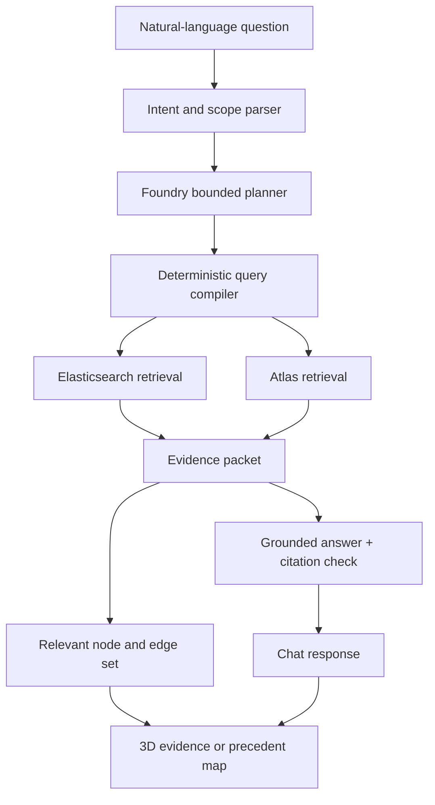

# Lloyd Evidence Constellation and Ask Lloyd

## Technical Design Document

**Status:** Proposed implementation design  
**Parent system:** Lloyd privacy-preserving underwriting investigation platform  
**Features:** Query-focused 3D evidence visualization and grounded natural-language search over Elasticsearch and MongoDB Atlas

---

## 1. Executive Summary

This proposal adds two tightly connected features to Lloyd:

1. **Ask Lloyd** - a natural-language interface for questions about a case, its evidence, appetite findings, and comparable historical cases.
2. **Evidence Constellation** - an interactive 3D representation of the documents or cases returned for the current question.

The chatbot is not an unrestricted database agent and the visualization is not decorative. A question produces a bounded retrieval plan, executes allowlisted Elasticsearch and Atlas operations, generates a cited answer, and focuses the 3D scene on the exact documents or cases used to answer it.

Two vector spaces remain separate:

- **Elasticsearch evidence space:** sanitized document chunks represented by the current 32-dimension semantic vector.
- **Atlas precedent space:** normalized cases represented by the eight-dimension structured underwriting risk vector.

The UI provides an **Evidence** map and a **Precedents** map rather than projecting incompatible vectors into one space. Projected 3D distance is approximate; similarity, ranking, and graph edges are always calculated in the original vector space.

### 1.1 Product promise

> Ask an underwriting question in ordinary language, receive a source-grounded answer, and immediately see and open the evidence or precedents behind it.

### 1.2 Core design decisions

- Retrieval is performed by Elasticsearch and Atlas, not by the language model's memory.
- The Microsoft Foundry agent selects from bounded query operations; deterministic code compiles and validates every query.
- Elasticsearch remains chunk-level for retrieval, but the 3D evidence map is document-level to avoid visual clutter.
- Atlas remains case-level for precedent retrieval and visualization.
- Answers must cite source IDs and return `NOT_ENOUGH_EVIDENCE` instead of filling gaps.
- Clicking a citation focuses its 3D node; clicking a node opens the relevant excerpt, page, or case comparison.
- The feature is read-only. It cannot mutate verified facts, appetite rules, decisions, or external systems.

---

## 2. Goals and Non-Goals

### 2.1 Goals

- Answer case-specific underwriting questions using sanitized, authorized data.
- Search exact insurance terminology and semantically related evidence.
- Retrieve structured case state and comparable cases from Atlas.
- Combine Elasticsearch evidence and Atlas precedents when a question requires both.
- Attach sentence-level citations to factual answer claims.
- Show why every returned document or case is relevant.
- Allow users to move naturally between chat, evidence details, and the 3D map.
- Preserve stable map positions between questions through versioned projections.
- Expose the retrieval plan and data sources in an expandable trace.
- Work without 3D acceleration through an accessible ranked-list fallback.

### 2.2 Non-goals

- Making an appetite decision in the chat layer
- Updating verified case facts through conversation
- Plotting Atlas risk vectors and Elasticsearch text vectors in one shared geometry
- Treating 3D distance as an authoritative similarity measure
- Connecting every document to every similar document
- Allowing arbitrary Elasticsearch DSL or MongoDB aggregation generated by a model
- Answering from unredacted local RDK documents
- Replacing the deterministic investigation agent or appetite engine
- Building a general-purpose business-intelligence assistant

---

## 3. User Experience

### 3.1 Entry points

The feature is available in two places:

1. **Case workspace - Ask Lloyd panel:** automatically scoped to the open case.
2. **Evidence Explorer route:** supports authorized cross-case evidence and precedent questions.

The case workspace is the primary demo path. The global explorer is useful for portfolio research but must require explicit filters and authorization.

### 3.2 Desktop layout

```text
┌─────────────────────────┬─────────────────────────────────────────┐
│ Ask Lloyd               │ Evidence Constellation                  │
│                         │                                         │
│ Question history        │  [Evidence] [Precedents] [List]        │
│ Answer with citations   │                                         │
│ Suggested follow-ups    │  Query-focused 3D scene                 │
│ Retrieval trace         │                                         │
├─────────────────────────┴─────────────────────┬───────────────────┤
│ Selected source excerpt / case comparison     │ Filters + legend  │
└───────────────────────────────────────────────┴───────────────────┘
```

On smaller screens, the map becomes a separate tab and the ranked source list is the default representation.

### 3.3 Example questions

- "Why is Harrisburg Bindery still under investigation?"
- "What evidence contradicts the sprinkler questionnaire?"
- "Show the loss documents supporting the five-year total."
- "Which appetite guideline applies to this premium?"
- "Find similar risks with acceptable construction and lower losses."
- "How is this case different from its three closest precedents?"
- "Which facts came from Gemini rather than Federato?"
- "Do we have enough evidence to verify the building year?"

### 3.4 Interaction sequence

1. The user submits a question.
2. Lloyd displays the interpreted intent and effective scope.
3. The Foundry agent selects one bounded retrieval action at a time.
4. Deterministic code applies authorization filters and executes searches.
5. Retrieved chunks are collapsed into documents; case results remain case-level.
6. The answer generator receives only the retrieved evidence packet.
7. Lloyd verifies citation coverage and returns an answer or an insufficiency state.
8. Relevant nodes appear or brighten in the active map.
9. Selecting a citation or node opens the exact passage, page, fact, or comparison.

---

## 4. System Architecture



### 4.1 Responsibility boundaries

| Component | Responsibility | Must not do |
|---|---|---|
| Foundry agent | Select a bounded retrieval operation and propose structured arguments | Emit or execute arbitrary database queries |
| Query compiler | Validate scope, fields, filters, limits, and permissions | Interpret underwriting meaning beyond encoded rules |
| Elasticsearch | Retrieve sanitized evidence chunks and documents | Store canonical case decisions |
| MongoDB Atlas | Return case state, filters, aggregations, and similar cases | Replace source-faithful evidence search |
| Answer generator | Summarize retrieved evidence with citations | Add facts not present in the evidence packet |
| Projection service | Produce stable visual coordinates and graph metadata | Calculate authoritative appetite or similarity decisions |
| Web client | Render chat, map, evidence, and trace | Access databases directly |

---

## 5. Natural-Language Query Planning

### 5.1 Supported intents

```typescript
type AskIntent =
  | "CASE_EXPLANATION"
  | "EVIDENCE_SEARCH"
  | "GUIDELINE_LOOKUP"
  | "CASE_FACT_LOOKUP"
  | "PRECEDENT_SEARCH"
  | "PRECEDENT_COMPARISON"
  | "PORTFOLIO_FILTER"
  | "COMBINED_INVESTIGATION";
```

### 5.2 Retrieval routing

| Intent | Primary system | Example |
|---|---|---|
| Case explanation | Atlas + cited decision evidence | Why is the case under investigation? |
| Evidence search | Elasticsearch | What contradicts sprinkler coverage? |
| Guideline lookup | Elasticsearch guideline index | What rule applies to $176K premium? |
| Case fact lookup | Atlas canonical case state | What is the normalized five-year loss total? |
| Precedent search | Atlas Vector Search | Find risks most similar to this one. |
| Precedent comparison | Atlas + supporting Elasticsearch evidence | Why was this precedent accepted? |
| Portfolio filter | Atlas allowlisted filter/aggregation | Which PA cases have unknown construction? |
| Combined investigation | Elasticsearch + Atlas | How does this evidence compare with prior accepted cases? |

Tiger Data operational metrics are outside the first version of Ask Lloyd. Operational questions should be routed to the existing analytics screen rather than silently querying a third system.

### 5.3 Planner contract

The Foundry agent emits only this structured plan:

```json
{
  "intent": "COMBINED_INVESTIGATION",
  "question": "What contradicts sprinkler coverage, and how did similar cases resolve it?",
  "scope": {
    "caseId": "case:harrisburg-bindery",
    "tenantId": "carrier-demo",
    "timeRange": null
  },
  "steps": [
    {
      "operation": "SEARCH_EVIDENCE",
      "query": "sprinkler protection impairment annex",
      "filters": {
        "caseId": "case:harrisburg-bindery",
        "sourceTypes": ["questionnaire", "inspection_report"]
      },
      "limit": 12
    },
    {
      "operation": "FIND_PRECEDENTS",
      "sourceCaseId": "case:harrisburg-bindery",
      "filters": {
        "finalDecision": ["IN_APPETITE", "ACCEPT_WITH_CONDITIONS"]
      },
      "limit": 5
    }
  ]
}
```

The application rejects unknown operations, fields, operators, collections, indexes, or limits. Authorization scope is injected by the server and cannot be weakened by the plan.

### 5.4 Bounded operations

```typescript
type AskOperation =
  | "GET_CASE"
  | "GET_DECISION_EVIDENCE"
  | "SEARCH_EVIDENCE"
  | "SEARCH_GUIDELINES"
  | "FILTER_CASES"
  | "FIND_PRECEDENTS"
  | "COMPARE_CASES";
```

Maximums per question:

- Three retrieval steps
- Twenty Elasticsearch chunks before document collapse
- Ten evidence documents after collapse
- Five Atlas precedents
- One constrained answer-repair pass
- Eight-second interactive timeout before partial-result fallback

---

## 6. Elasticsearch Retrieval

### 6.1 Retrieval unit

Search remains chunk-level because the relevant evidence may be one paragraph or table row. Each chunk includes:

- `chunkId`
- `documentId`
- `caseId`
- `sourceType`
- `title`
- sanitized `text`
- 32-dimension dense vector
- page and bounding-box provenance when available
- verification status
- reliability
- observed/effective timestamps
- authorization metadata

### 6.2 Hybrid search pipeline

1. Parse the question into a focused lexical query and approved filters.
2. Run BM25 over title, text, identifiers, and normalized insurance terminology.
3. Run dense k-nearest-neighbor search over the 32-dimension evidence vector.
4. Fuse the rankings with reciprocal-rank fusion.
5. Apply a reranker if configured and available.
6. Collapse chunks by `documentId`, retaining the top matching passages.
7. Return source metadata, exact passages, scores, and match explanations.

Application-side reciprocal-rank fusion is acceptable if the deployed Elasticsearch version lacks the required native primitive.

### 6.3 Document score

```text
document_score =
    max(chunk_fused_score)
  + 0.15 * supporting_chunk_coverage
  + 0.10 * source_reliability
  + 0.05 * freshness_score
```

The score ranks evidence for presentation; it does not determine whether a fact is verified or acceptable.

### 6.4 Document vector for visualization

The map displays one node per source document. Its vector is a normalized weighted centroid of its sanitized chunk vectors:

```text
document_vector = normalize(
  sum(chunk_vector_i * chunk_importance_i) /
  sum(chunk_importance_i)
)
```

`chunk_importance` defaults to one and may be increased for headings, extracted tables, or human-verified passages. Retrieval still uses original chunks; the centroid is only for document-level navigation and visualization.

---

## 7. Atlas Retrieval

### 7.1 Canonical case queries

Case fact and portfolio questions use allowlisted projections, predicates, sorts, and aggregations. The model cannot submit a raw MongoDB pipeline.

Supported filter dimensions initially include:

- Decision class
- Criterion state
- State
- Line of business
- Submission type
- Premium range
- TIV range
- Building-year range
- Construction status
- Five-year loss range
- Completeness and confidence

### 7.2 Precedent retrieval

Each normalized case version has an eight-dimension risk profile:

```text
[
  submission_type,
  line_of_business,
  primary_state,
  total_insured_value,
  premium,
  building_year,
  construction_mix,
  five_year_loss_value
]
```

Categorical dimensions use documented deterministic encodings. Numeric dimensions are scaled with versioned parameters. Missing values include explicit missingness indicators in the retrieval metadata and cannot silently become zero-risk values.

Atlas Vector Search returns nearest cases plus:

- Original-space similarity
- Shared factors
- Material differences
- Historical decision
- Decision version and date
- Human-approval status
- Supporting evidence IDs

The current case and superseded case versions are excluded by default.

---

## 8. Grounded Answer Generation

### 8.1 Evidence packet

The answer generator receives a compact packet rather than direct database access:

```typescript
interface AnswerEvidencePacket {
  question: string;
  effectiveScope: {
    tenantId: string;
    caseId?: string;
  };
  caseFacts: Array<{
    factId: string;
    name: string;
    value: unknown;
    status: string;
    evidenceIds: string[];
  }>;
  evidence: Array<{
    evidenceId: string;
    documentId: string;
    title: string;
    page?: number;
    excerpt: string;
    sourceType: string;
    verificationStatus: string;
  }>;
  precedents: Array<{
    caseId: string;
    similarity: number;
    sharedFactors: string[];
    materialDifferences: string[];
    decision: string;
    rationaleEvidenceIds: string[];
  }>;
}
```

### 8.2 Response contract

```typescript
interface AskLloydResponse {
  answerId: string;
  status: "ANSWERED" | "PARTIAL" | "NOT_ENOUGH_EVIDENCE";
  answerMarkdown: string;
  claims: Array<{
    claim: string;
    evidenceIds: string[];
  }>;
  citations: Array<{
    evidenceId: string;
    documentId?: string;
    caseId?: string;
    label: string;
    page?: number;
    excerpt?: string;
  }>;
  focusNodes: string[];
  suggestedQuestions: string[];
  retrievalTraceId: string;
}
```

### 8.3 Citation gate

Before displaying the answer:

1. Split the draft into factual claims.
2. Require at least one accessible evidence or case ID for every factual claim.
3. Confirm the cited item supports the claim rather than merely sharing keywords.
4. Remove or repair unsupported claims once.
5. Return `PARTIAL` or `NOT_ENOUGH_EVIDENCE` if support remains insufficient.

The response may say, "The available documents do not establish the construction percentage." It may not infer an acceptable percentage from the absence of a contrary record.

---

## 9. Evidence Constellation

### 9.1 Two explicit modes

#### Evidence mode

- Node: one sanitized source document
- Vector: normalized 32-dimension document centroid
- Retrieval: Elasticsearch chunk search collapsed by document
- Edge: original-space document cosine similarity or explicit citation/reference relationship
- Detail panel: matching excerpts, pages, provenance, reliability, and verification state

#### Precedents mode

- Node: one normalized Atlas case version
- Vector: standardized eight-dimension risk profile
- Retrieval: Atlas Vector Search
- Edge: original-space case similarity
- Detail panel: shared factors, material differences, decision, rationale, and human approval

The map never draws similarity edges between a document node and a case node. A cross-system relationship such as "this document supports this case" is shown in the detail panel or a separate provenance link, not as geometric similarity.

### 9.2 Projection pipeline

For each vector corpus:

1. Select the current active, authorized corpus snapshot.
2. Normalize the vectors using versioned parameters.
3. Fit PCA to three dimensions for the stable default layout.
4. Store the transform, explained-variance metadata, coordinates, and `projectionVersion`.
5. Use the same transform for new vectors until a scheduled rebuild threshold is reached.
6. Rebuild when corpus growth or drift exceeds configuration, then animate old-to-new coordinates.

UMAP may be added as an experimental layout, but PCA is the default because it is deterministic, supports out-of-sample transformation, and keeps positions stable during a demo.

The UI must display:

> Layout is an approximate projection. Similarity scores and edges use the original vector space.

### 9.3 Query anchor

In Evidence mode, the 32-dimension query vector can be transformed by the current PCA model and rendered as a temporary highlighted anchor. Lines connect it only to returned documents.

In Precedents mode, the selected case is the anchor. If no case is selected, precedent visualization is disabled until a structured risk profile can be constructed without inventing missing values.

### 9.4 Edges

- Maximum three similarity edges per node by default
- Edge requires an original-space similarity above the configured threshold
- Query anchor may connect to every displayed result, capped at ten
- Thicker line means higher original-space similarity
- Dashed line means explicit provenance/reference rather than semantic similarity
- K-means cluster membership never creates an edge

### 9.5 Optional clustering

K-means may provide broad color groupings within one vector space. It is used only for navigation and descriptive labels.

- Cluster count is configured per corpus and versioned.
- Labels are generated from representative titles/factors and reviewed before demo use.
- The UI calls clusters "themes" or "risk groups," not objective categories.
- Users can turn cluster color off and color by source type, verification status, or decision instead.

### 9.6 Visual encodings

#### Evidence mode

| Encoding | Meaning |
|---|---|
| Position | Approximate PCA projection of document centroid |
| Color | Source type or verification status |
| Size | Relevance to the current question |
| Halo | Cited by the displayed answer |
| Opacity | Outside current filters or low relevance |
| Solid edge | Semantic similarity |
| Dashed edge | Explicit document/reference relationship |

#### Precedents mode

| Encoding | Meaning |
|---|---|
| Position | Approximate PCA projection of eight-dimension risk profile |
| Color | Final appetite decision |
| Size | Similarity to selected case |
| Halo | Human-approved historical decision |
| Edge | Original-space nearest-neighbor relationship |

### 9.7 Interaction

- Hover shows title, source type, score, and top matching reason.
- Click opens the evidence or precedent drawer.
- Shift-click pins nodes for comparison.
- Clicking a chat citation focuses and pulses its node.
- Clicking "Use in question" inserts an explicit source reference into the composer.
- Filters update both the ranked list and visible nodes.
- "Reset to answer" returns the camera and filters to the current answer's sources.
- List mode offers equivalent functionality without WebGL.

### 9.8 Performance limits

- Default visible nodes: 30
- Maximum interactive nodes: 150
- Maximum rendered edges: 300
- Target: 60 FPS on a recent laptop, 30 FPS minimum
- Use instanced meshes and batched line geometry
- Load node metadata lazily after selection
- Never transfer full document text in the initial map payload
- Fall back to the ranked list after WebGL failure or reduced-motion/accessibility preference

---

## 10. Data Models

### 10.1 Elasticsearch document projection index

```json
{
  "document_id": "doc:harrisburg:sprinkler-questionnaire",
  "case_id": "case:harrisburg-bindery",
  "title": "Sprinkler and Protection Questionnaire",
  "source_type": "questionnaire",
  "chunk_ids": ["ev_101", "ev_102"],
  "document_vector_32": [0.12, -0.04, 0.08],
  "projection": {
    "version": "evidence-pca-2026-09-20",
    "x": 0.41,
    "y": -0.12,
    "z": 0.76
  },
  "verification_status": "CONTRADICTED",
  "authorization": {
    "tenant_id": "carrier-demo",
    "visibility": "case_team"
  }
}
```

The example vector is abbreviated; production validation requires exactly 32 values.

### 10.2 Atlas case projection

```json
{
  "caseId": "case:harrisburg-bindery",
  "caseVersion": 3,
  "riskProfileVersion": "risk-v1",
  "riskProfile8": [1, 1, 0.8, 0.33, 0.17, -1, -1, -1],
  "projection": {
    "version": "precedent-pca-2026-09-20",
    "x": -0.21,
    "y": 0.64,
    "z": 0.09
  },
  "decision": "INVESTIGATE",
  "humanApproved": false
}
```

### 10.3 Chat session

```json
{
  "sessionId": "ask_123",
  "tenantId": "carrier-demo",
  "caseId": "case:harrisburg-bindery",
  "messages": [
    {
      "messageId": "msg_1",
      "role": "user",
      "text": "What contradicts sprinkler coverage?",
      "createdAt": "2026-09-20T18:00:00Z"
    }
  ],
  "activeAnswerId": "answer_1",
  "createdBy": "underwriter:demo",
  "createdAt": "2026-09-20T18:00:00Z"
}
```

Store only sanitized conversation content. Avoid copying full retrieved documents into session history; retain evidence IDs and short excerpts instead.

---

## 11. API Surface

```text
POST /api/ask/sessions
GET  /api/ask/sessions/:sessionId
POST /api/ask/sessions/:sessionId/messages
GET  /api/ask/answers/:answerId
GET  /api/ask/traces/:traceId

POST /api/explore/evidence/query
GET  /api/explore/evidence/nodes/:documentId
GET  /api/explore/evidence/projections/:version

POST /api/explore/precedents/query
GET  /api/explore/precedents/nodes/:caseId
GET  /api/explore/precedents/projections/:version
```

### 11.1 Ask request

```json
{
  "question": "What evidence contradicts sprinkler coverage?",
  "caseId": "case:harrisburg-bindery",
  "activeMode": "evidence",
  "pinnedNodeIds": []
}
```

### 11.2 Streaming events

`POST /messages` streams server-sent events:

```text
intent
retrieval_started
retrieval_results
answer_delta
citations
map_focus
completed
error
```

The UI can render retrieved documents before answer generation finishes. Internal chain-of-thought is never streamed; only the operation, purpose, filters, counts, and timing are shown.

### 11.3 Explore response

```typescript
interface ExploreGraph {
  mode: "evidence" | "precedents";
  projectionVersion: string;
  nodes: Array<{
    id: string;
    x: number;
    y: number;
    z: number;
    label: string;
    type: string;
    relevance: number;
    cited: boolean;
    metadataPreview: Record<string, string | number | boolean>;
  }>;
  edges: Array<{
    source: string;
    target: string;
    relationship: "SIMILARITY" | "PROVENANCE" | "QUERY_MATCH";
    score?: number;
  }>;
  notice: string;
}
```

---

## 12. Security and Privacy

- Only sanitized Elasticsearch evidence and authorized Atlas case state may be queried.
- Tenant, user, and case filters are injected server-side after planning.
- The Foundry agent cannot remove or weaken authorization predicates.
- Retrieval from another case is disabled in the case workspace unless the user has precedent access.
- Atlas precedents expose only approved normalized facts and rationale, not raw submission documents.
- Full document text is never sent to the browser merely to render the map.
- Retrieved evidence is treated as untrusted data and cannot issue instructions to the agent.
- Prompt-injection text is isolated from system instructions and labeled as evidence.
- Query plans use allowlisted operations, fields, filters, and limits.
- Questions, excerpts, and traces are sanitized before logging.
- Chat history has an explicit retention policy and deletion endpoint.
- Every answer stores the effective authorization scope, retrieval IDs, and model/prompt version.

---

## 13. Failure Modes

| Failure | Behavior |
|---|---|
| Elasticsearch unavailable | Return Atlas facts/precedents only and label evidence search unavailable |
| Atlas unavailable | Return Elasticsearch evidence only and disable precedent mode |
| Foundry planner unavailable | Use deterministic intent routing for common question templates |
| Answer model unavailable | Show ranked evidence and case data without generated prose |
| Projection unavailable | Show ranked list and schedule projection rebuild |
| WebGL unavailable | Automatically switch to list mode |
| No supporting evidence | Return `NOT_ENOUGH_EVIDENCE` with suggested next information request |
| Citation gate failure | Return partial answer and clearly identify unsupported portion |
| Unauthorized result detected | Drop the result, record a security event, and fail closed |
| Excessively broad question | Ask the user to narrow by case, date, state, or document type |

The underwriting case page and deterministic appetite decision remain usable during every optional feature failure.

---

## 14. Testing Strategy

### 14.1 Retrieval tests

- Exact policy, claim, and guideline identifiers rank through BM25.
- Paraphrased evidence ranks through dense retrieval.
- Reciprocal-rank fusion improves a fixed evaluation set over either retrieval mode alone.
- Chunk collapse preserves the best passage and correct document provenance.
- Case and tenant filters prevent cross-scope leakage.
- Precedent retrieval excludes the current case and superseded versions.
- Missing structured dimensions are not interpreted as favorable zero values.

### 14.2 Answer tests

- Every factual claim has at least one accessible citation.
- Citations point to passages that actually support the claim.
- A deliberately unsupported statement is removed or produces `PARTIAL`.
- Missing evidence produces `NOT_ENOUGH_EVIDENCE` rather than speculation.
- Contradicted sources are represented as disagreement rather than silently resolved.
- Prompt injection inside a retrieved document cannot alter query scope or tool permissions.

### 14.3 Visualization tests

- Displayed similarity scores match original-space calculations.
- Edges connect only nodes from the same vector space unless explicitly marked as provenance.
- PCA coordinates are deterministic for a fixed projection version.
- A newly transformed vector uses the stored transform rather than silently refitting the corpus.
- Clicking a citation focuses the correct node and opens the correct page/excerpt.
- Filters produce the same result set in map and list modes.
- Scene remains responsive at 150 nodes and 300 edges.
- Keyboard and list-mode interactions cover every map action.

### 14.4 Security tests

- Planner attempts to remove tenant or case filters are rejected.
- Unknown database fields and operators are rejected.
- Raw MongoDB pipelines and Elasticsearch DSL are rejected.
- Unredacted canary values never appear in answer prompts, responses, map payloads, or logs.
- Users without precedent permission cannot retrieve cross-case nodes.

### 14.5 Quality metrics

Track on a small labeled question set:

- Evidence Recall@10
- nDCG@10 or MRR for ranked evidence
- Citation precision
- Claim citation coverage
- Correct intent-routing rate
- `NOT_ENOUGH_EVIDENCE` correctness
- Median first-result latency
- Median completed-answer latency
- Map frame rate and interaction latency

---

## 15. Implementation Plan

### Phase 0: Contracts and fixtures

1. Define ask, citation, node, edge, and projection contracts.
2. Create 15-20 labeled demo questions across the supported intents.
3. Create expected evidence IDs and precedents for each question.
4. Implement fixture-backed responses for frontend development.

Exit criterion: the full chat/map flow works with deterministic fixtures.

### Phase 1: Ranked evidence list

1. Implement Elasticsearch hybrid search and document collapse.
2. Implement Atlas case lookup and precedent retrieval.
3. Add deterministic intent routing for core question templates.
4. Display ranked evidence and precedents without answer generation.

Exit criterion: users can ask a question and open the correct source data.

### Phase 2: Grounded answers

1. Add the Foundry structured planner.
2. Build evidence packets.
3. Add answer generation and citation verification.
4. Add `ANSWERED`, `PARTIAL`, and `NOT_ENOUGH_EVIDENCE` behavior.
5. Stream visible retrieval progress and answer events.

Exit criterion: every factual answer statement is source-backed.

### Phase 3: Stable projections

1. Compute document centroids for Elasticsearch evidence.
2. Standardize Atlas risk profiles.
3. Fit and version separate PCA transforms.
4. Store coordinates and original-space nearest neighbors.
5. Add rebuild and drift-detection scripts.

Exit criterion: stable map payloads exist for both vector spaces.

### Phase 4: Interactive visualization

1. Implement Evidence and Precedents modes with React Three Fiber.
2. Add node selection, citation focusing, filters, legends, and comparison pinning.
3. Add instancing and node/edge limits.
4. Add equivalent list mode and reduced-motion handling.

Exit criterion: the answer, citations, source drawer, and map operate as one workflow.

### Phase 5: Demo hardening

1. Add deterministic fallbacks for planner, retrieval, answer, and projection failures.
2. Evaluate labeled questions and correct retrieval failures.
3. Add leakage, prompt-injection, and authorization tests.
4. Cache the primary demo query results without bypassing visible retrieval logic.
5. Rehearse one evidence question and one precedent-comparison question.

---

## 16. Suggested Repository Structure

```text
apps/
  api/src/routes/
    ask.ts
    explore-evidence.ts
    explore-precedents.ts
  web/app/
    cases/[id]/ask/
    explore/
  web/components/ask-lloyd/
    ChatPanel.tsx
    AnswerCitations.tsx
    RetrievalTrace.tsx
    SuggestedQuestions.tsx
  web/components/evidence-constellation/
    ConstellationScene.tsx
    EvidenceNode.tsx
    PrecedentNode.tsx
    GraphEdges.tsx
    MapFilters.tsx
    SourceDrawer.tsx
    AccessibleResultList.tsx

packages/
  ask-contracts/
  query-planner/
  grounded-answer/
  projection-service/
  elastic-context/
  atlas-memory/

scripts/
  rebuild-evidence-projection.ts
  rebuild-precedent-projection.ts
  evaluate-ask-lloyd.ts

tests/
  fixtures/ask-lloyd/
  integration/ask/
  security/ask/
  unit/projection/
```

---

## 17. Demo Script

### Question 1: Evidence contradiction

Ask:

> What evidence contradicts sprinkler coverage for Harrisburg Bindery?

Expected behavior:

1. Lloyd scopes the query to Harrisburg Bindery.
2. Elasticsearch runs BM25 and vector retrieval.
3. The answer cites the questionnaire claiming full protection and the inspector note identifying an unprotected annex.
4. Evidence Constellation highlights both documents and draws their relationship to the query anchor.
5. Clicking either citation opens the exact passage.
6. Lloyd concludes that sprinkler protection remains `CONTRADICTED`; it does not decide appetite itself.

### Question 2: Comparable resolutions

Ask:

> Show similar accepted cases and explain how they resolved sprinkler uncertainty.

Expected behavior:

1. Atlas retrieves the nearest human-approved cases using the eight-dimension risk profile.
2. Precedents mode displays the selected case and its nearest neighbors.
3. The answer lists shared factors and material differences.
4. Supporting Elasticsearch evidence explains the historical resolution where authorized.
5. The user pins two precedents and compares their evidence requirements.

### Question 3: Honest insufficiency

Ask:

> What percentage of Harrisburg's TIV is acceptable construction?

Expected behavior:

1. Atlas shows the normalized construction percentage as unknown.
2. Elasticsearch finds masonry wording but no TIV allocation.
3. Lloyd returns `NOT_ENOUGH_EVIDENCE` and recommends requesting a TIV-weighted construction schedule.

---

## 18. Acceptance Criteria

- [ ] Users can ask a case-scoped question in natural language.
- [ ] Every question is converted into allowlisted structured operations.
- [ ] Server-side authorization scope cannot be weakened by the planner.
- [ ] Elasticsearch uses lexical and vector retrieval with document collapse.
- [ ] Atlas supports case facts, filters, and eight-dimension precedent search.
- [ ] Every factual answer claim has an accessible supporting citation.
- [ ] Insufficient evidence produces an explicit insufficiency state.
- [ ] Clicking a citation focuses the corresponding node and source passage.
- [ ] Evidence and precedent vectors are never mixed in one similarity projection.
- [ ] Document nodes use centroids only for visualization; retrieval remains chunk-level.
- [ ] Similarity edges and displayed scores use original vector spaces.
- [ ] PCA coordinates and transforms carry a visible projection version.
- [ ] Evidence and Precedents map modes both have equivalent ranked-list views.
- [ ] The visualization remains usable at 150 nodes and 300 edges.
- [ ] The feature continues with partial functionality when either data system is unavailable.
- [ ] Unredacted canary values never appear in model prompts, answers, map payloads, or logs.
- [ ] The three demo questions run successfully from a clean start or documented cached fallback.

---

## 19. Scope Recommendation

Build the ranked evidence/chat workflow before the 3D renderer. The highest-value sequence is:

1. Natural-language intent routing
2. Elasticsearch hybrid retrieval
3. Atlas fact and precedent retrieval
4. Source drawer and ranked results
5. Grounded answer with citations
6. Stable PCA coordinates
7. Query-focused Evidence map
8. Precedent map
9. Optional K-means coloring and advanced animation

If time becomes constrained, ship the full chat, citations, source drawer, and ranked list with a smaller 3D scene limited to the current answer's documents. That preserves the underwriting value and makes the visualization demonstrate retrieval rather than distract from it.
