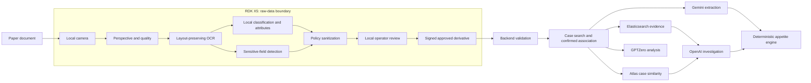

# Lloyd: privacy-preserving document intake and cloud investigation

**Status:** Draft for implementation. **Date:** 2026-09-19. **Version:** 2.0-draft.  
**Scope:** Migration from the current Python RDK gateway and TypeScript backend to the responsibility split specified by the product owner. This document describes required future behavior; it does not claim those capabilities are already deployed.

## 1. Authority and scope

The user's edge/cloud responsibility table is the target architecture. This TDD supplements `Federato_RiskGraph_TDD.md` and supersedes its statement that local model inference is optional: **an actual on-device AI model for broad document classification and attribute hints is required.** A generative LLM is not intrinsically required; a trained document/text classifier satisfies this requirement if it meets the acceptance gates. Regex rules alone do not.

The original deterministic appetite rules, boundary handling, verified-fact provenance, simulation separation, and prohibition on model-driven underwriting decisions remain authoritative. This migration must not alter those rules. Models may propose classifications and candidate facts; deterministic code owns release policy, validation, case association permissions, and appetite evaluation.

The target is an intake appliance, not an underwriting server on the RDK. The board must remain useful without internet access. Cloud enrichment starts only after an operator approves an exact sanitized derivative.

## 2. Current implementation and observed gaps

Baseline: the working tree at `/Users/yash/Documents/lloyd`, plus an SSH audit of `/opt/lloyd-edge-gateway` on the board. The working tree contains concurrent, uncommitted changes; it is not identical to the deployed board. Record exact source commit, dirty-tree patch hash, and deployed artifact digest before implementation begins.

| Area | Current evidence | Required change |
|---|---|---|
| Capture | `gateway/capture.py`: USB camera via OpenCV, configurable camera index; physical capture succeeded | Multi-page capture sessions, stable page identity, reliable framing and perspective correction |
| Preprocessing | Contour-based perspective transform, Laplacian blur, bright-pixel glare metric | Synthetic trapezoid was not corrected; white paper was misclassified as glare. Replace/calibrate those checks |
| OCR | Local Tesseract, optional locally provisioned Paddle adapter | Preserve words, lines, pages, boxes, orientation, and confidence; do not flatten layout |
| Privacy detection | Regex patterns, case-scoped HMAC tokens, encrypted local store | Add semantic detection coverage and region mapping; validate labeled and unlabeled sensitive content |
| Redaction | Text replacement; whole-page black preview | Selective, irreversible redaction once validated; preserve safe facts and table structure |
| Local classification | No inference stage or classifier output; health reports `localLLM: false` | Provision and run a real local model; expose model identity, confidence, abstention, and runtime status |
| Case association | Capture requires caller-supplied `caseId` | Permit unassigned intake; generate approved, privacy-safe hints; backend searches/ranks; operator confirms |
| Release | v1 text-only manifest; authenticated approval; hash and destination validation | Versioned v2 contract covering all released bytes and metadata, revisions, device identity, replay protection |
| Cloud extraction | Gemini schema currently permits building year, premium, TIV and document type from text | Layout-aware tables, typed rows, provenance, and reconciliation without automatic promotion to verified facts |
| Search | Elasticsearch evidence index; Atlas case feature vectors | Preserve separation of evidence retrieval, case matching, and underwriting similarity |
| Planning | Scripted, OpenAI and recently added Foundry planner implementations | Explicit provider selection; OpenAI is the target owner; no silent provider substitution |
| Tests | 14 gateway tests pass; approved synthetic release reached real backend and Elasticsearch | Expand tests to photographed pages, layout preservation, model inference, hints, and adversarial privacy cases |

Observed image-path defect: OCR joins words with spaces. Line-based privacy patterns then consume subsequent safe fields. A synthetic page lost both `2016` and its construction description after redaction. Passing privacy canaries alone is insufficient: acceptance must also measure preservation of useful evidence.

The working tree also contains a raw camera preview stream. Treat raw preview as a privileged local-only feature, regardless of whether it is deployed. It must never be proxied through the cloud application.

## 3. Required responsibility split

| Task | RDK X5 | Cloud/backend |
|---|---|---|
| Capture and perspective correction | Capture, orient, detect page boundary, correct perspective | Never receive originals for preprocessing |
| OCR quality evaluation | Evaluate image and OCR quality; request recapture | Validate supplied quality/provenance; do not substitute cloud OCR of originals |
| Sensitive-data detection | Patterns plus local semantic detection; build sensitive regions | Independently validate sanitized content; reject suspect derivatives |
| Redaction/tokenization | Apply irreversible redaction, tokenization and approved generalization | Enforce manifest, destination policy, signature and permitted field schema |
| Broad document classification | Run local model and produce unverified labels/attributes | Confirm/refine using sanitized evidence; preserve disagreements |
| Case-match hints | Generate minimal, privacy-safe hints | Search and rank authorized cases; require confirmed association |
| Detailed table extraction | Optional local preview; never authoritative | Gemini extracts structured tables from approved sanitized artifacts |
| Evidence retrieval | None | Elasticsearch hybrid retrieval with case and tenant filters |
| Case similarity | None | MongoDB Atlas case similarity, distinct from identity matching |
| Appetite evaluation | None | Existing deterministic engine |
| Investigation planning | None | OpenAI, behind the existing bounded tool contract |
| Authenticity analysis | None | GPTZero; advisory signals subject to explicit review policy |

Tiger Data stores operational metrics only. Atlas remains the system of record. No raw documents, OCR bodies, token maps, prompts, or customer identifiers belong in telemetry.

## 4. Deployment and trust boundaries



Raw camera frames, full OCR, local inference input/output, intermediate images, region coordinates linked to raw content, and reversible token maps remain encrypted on the board. A paired local operator browser may display raw preview only through an explicitly authorized local connection; no cloud proxy, analytics SDK, service worker cache, or remote logging may capture it. Raw preview is opt-in, short-lived, authenticated, and unavailable to cross-origin callers by default.

Provider keys, MongoDB credentials, Elasticsearch credentials, and Tiger connection strings remain on the backend. The board holds only device authentication/signing material, local reviewer authentication configuration, encryption keys, and local model artifacts. Device authentication is not evidence that a human approved a release.

CPU inference is the correctness baseline. BPU acceleration is optional and must preserve tested output semantics. The board may be USB-only with no DNS; installation, model provisioning and updates must support offline transfer from the laptop.

## 5. Local processing pipeline

### 5.1 Capture, layout and quality

Represent a document as an ordered page set. Preserve the original capture encrypted locally and create a separate corrected page; do not overwrite the only original during perspective correction. Each page records dimensions, rotation, correction transform, capture adapter, and quality results.

OCR produces words and lines with stable IDs, text, pixel-space boxes on the corrected page, page number and confidence. Store the transform required to relate corrected-page regions to the original. Group Tesseract results by page/block/paragraph/line IDs instead of joining all words with spaces. A future Paddle adapter must implement the same contract.

Quality returns `PASS`, `REVIEW` or `RECAPTURE`, plus bounded reason codes such as `BLUR`, `CLIPPED_PAGE`, `GLARE_OCCLUSION`, `EMPTY_OCR`, `LOW_TEXT_CONFIDENCE`, and `PERSPECTIVE_UNCERTAIN`. Do not interpret normal white paper as glare solely from brightness. OCR confidence is a model score, not a calibrated probability that the page is correct.

Empty OCR, invalid geometry and unreadable pages block release. Reviewable uncertainty requires operator acknowledgment. Thresholds belong in a versioned quality policy and must be calibrated on captured pages; the existing blur >70/brightness <0.8 heuristic is not an accepted production threshold.

### 5.2 Actual local AI classification

Introduce a `DocumentClassifier` interface backed by a provisioned local inference runtime and trained weights. Inputs are local OCR/layout and, if required by the selected model, corrected local page images. No remote inference or automatic model download is allowed.

Required output:

- Primary document type: `inspection_report`, `loss_run`, `statement_of_values`, `application`, `policy_document`, `correspondence`, `mixed`, or `unknown`.
- Alternative labels and calibrated confidence, or an explicit `UNCALIBRATED` marker until validation is complete.
- Safe candidate attributes: language, page count, presence of tables, broad line of business, and date/risk-region candidates with local evidence references.
- `status`: `CLASSIFIED`, `ABSTAINED`, or `UNAVAILABLE`; model identifier, artifact digest, runtime version, latency and per-page evidence IDs.

Select the smallest model that passes the corpus and board benchmark. Evaluate a compact trained text classifier first; use a small quantized instruction model only if the former cannot meet the required attribute task. No particular model, license, RAM requirement or BPU compatibility is assumed validated by this draft. Model selection is the first engineering milestone, not a hidden deployment assumption.

A missing model, failed inference or out-of-distribution input must not silently become a successful regex classification. Manual classification can support a clearly labeled degraded workflow, but does not satisfy full-pipeline acceptance. Document instructions are untrusted data; inference has no tools, shell, network, or release capability.

### 5.3 Sensitive-field detection and sanitization

Combine deterministic detectors with local semantic detectors for unlabeled person names, addresses, signatures and other policy-defined sensitive regions. The document classifier and sensitive-data detector may use separate models. Classification success does not establish privacy coverage.

Additional model detections may only add sensitive regions. Deterministic policy assigns `LOCAL_ONLY`, `REDACTED`, `TOKENIZED`, `GENERALIZED`, or `CLOUD_ALLOWED`; a model cannot unredact or declare unrestricted release.

Union overlapping spans/boxes, apply conservative region padding, and preserve safe neighboring lines. Token maps remain local. Image derivatives must burn redactions into raster pixels, remove metadata and embedded text, and contain no recoverable original layers. Until selective image redaction passes acceptance, release sanitized text/layout only and explicitly report image/table limitations; a fully black page is not useful evidence.

Run every model-generated string through output schema and privacy validation. Prefer enums and bounded typed values. Local free-form explanations and raw quotations are not cloud-safe merely because a model generated them.

### 5.4 Case-match hints

Capture accepts an optional preselected case, but also supports unassigned intake. Generate only approved hints such as document type, generalized risk state, coarse date range, line of business, and appropriately bucketed values. Treat combinations of hints as potentially identifying; release the minimum needed and show them in review.

Do not release names, exact addresses, policy numbers, raw IDs, embeddings of raw sensitive text, or unsalted hashes of identifiers as shortcuts for matching. Existing case-scoped tokens cannot identify an unknown case and must not be reused as a cross-case matching scheme.

Backend candidate search is limited to the authenticated tenant and user's allowed cases. Return ranked candidates with reasons; the user confirms association. Similarity is not identity. Weak or ambiguous hints leave the intake unassigned. A known preselected case still requires authorization validation.

### 5.5 Review and release state machine

`CAPTURED -> PREPROCESSED -> OCR_COMPLETE -> ANALYZED -> SANITIZED -> REVIEW_READY -> APPROVED -> RELEASE_PENDING -> ACCEPTED`

Additional terminal/branch states: `RECAPTURE_REQUIRED`, `BLOCKED`, `LOCAL_MODEL_UNAVAILABLE`, `RELEASE_FAILED`, and `ORIGINAL_EXPIRED`.

Approval is mandatory in this target workflow. It binds an immutable derivative revision, exact artifact hashes, sanitized classification/hints, destinations, reviewer and policy version. Changing OCR, pages, classification metadata, redaction, hints, case selection or destinations invalidates approval. A lost response permits retry of the same approved revision, not recomputation under the old approval.

Before release, the operator sees quality warnings, document class, model status, proposed hints, redacted preview, destination list and the exact approved revision. The gateway must revalidate policy and hashes immediately before transmission.

## 6. Release contract v2

Add v2 alongside v1; do not overload the existing strict v1 schemas. Keep golden cross-language fixtures for Python and TypeScript.

Proposed envelope:

```typescript
interface IntakeV2 {
  manifest: {
    version: 2;
    intakeId: string;             // UUID; backend inbox identity
    documentId: string;           // UUID
    revision: number;
    deviceId: string;
    tenantId: string;             // must match authenticated device binding
    caseId: string | null;
    policyVersion: string;
    createdAt: string;
    classification: SafeClassification;
    matchHints: SafeMatchHints;
    quality: SafeQualitySummary;
    fields: PrivacyField[];
    artifacts: ArtifactDescriptor[]; // id, MIME type, byte length, SHA-256
    destinations: Destination[];
    approval: { reviewerId: string; approvedAt: string; expiresAt: string };
  };
  artifacts: ApprovedArtifact[];  // bounded text/layout or redacted raster bytes
  authentication: {
    keyId: string;
    algorithm: "HMAC-SHA256";
    signature: string;
  };
}
```

`SafeClassification`, `SafeMatchHints`, `SafeQualitySummary` and layout blocks are closed schemas with bounded collections and strings. Evidence references point only to released sanitized blocks. Artifact descriptors are the sole allowed attachments; reject duplicates, undeclared bytes, unexpected MIME types and size mismatches. Initial limits: 20 pages, 2 MB aggregate UTF-8 text, 10 MB per image, 25 MB per envelope. Stream or reject before buffering above limits; proxy limits must agree.

Sign a domain-separated RFC 8785 canonical representation of the complete manifest, including hashes of every artifact and all approved metadata. Do not invent a second ad hoc JSON canonicalizer. Reject non-finite numbers and invalid Unicode before signing. Verify constant-time using the paired device key selected by `keyId`. Maintain overlapping old/new keys only during an explicit rotation window.

Bind `(tenantId, deviceId, intakeId, revision)` to the envelope digest for idempotency: same identity and digest returns the existing receipt; changed digest returns 409. Record approval expiry and bounded clock-skew policy. Clock outside the configured tolerance blocks release with an actionable local message. Persist acceptance before acknowledging; a retry must not duplicate extraction, indexing or telemetry.

The backend independently validates schema, digest, signature, reviewer authorization, destination policy and sanitized content before storing derivatives or calling providers. Rejecting a suspected leak is not a request to upload the original for debugging. Record only a bounded rejection code.

## 7. Backend and provider behavior

### 7.1 Intake inbox and case association

Introduce a tenant-scoped `intakes` collection independent of `cases`. Validated but unassigned intakes remain in an inbox. Candidate search operates only on approved hints and authorized canonical case fields. Save candidate ranks and confirmed association separately from underwriting facts.

Changing the backend association is an authorized, audited operation with a reason; preserve the original released manifest. Downstream dispatch uses the confirmed association record, not an edited manifest. Do not extract or index case-specific evidence against guessed case IDs.

### 7.2 Gemini: confirmation and detailed extraction

After confirmed association and only when permitted by the manifest, Gemini confirms/refines document type and extracts typed tables: statement-of-values rows, loss-run rows, and inspection findings. Preserve page/block/cell references, currency/unit, source excerpt, and extraction status. Validate excerpts against released sanitized artifacts and retain disagreements with local classification.

Represent missing or redacted cells as unknown; never fill them from model inference. Reconcile totals deterministically and flag inconsistencies. Candidate values remain unverified until the existing evidence acceptance path promotes them; model confidence alone cannot change canonical underwriting facts.

### 7.3 Retrieval, similarity, planning and authenticity

- Elasticsearch indexes only accepted, associated sanitized evidence. Tenant and case authorization filters are mandatory for lexical and vector retrieval. The current 32-dimensional deterministic text embedding is a baseline, not a claimed learned semantic model. Any embedding-model migration requires a new index, explicit dimensions/model version, reindexing and retrieval evaluation.
- Atlas owns canonical cases and case similarity. Existing deterministic case feature vectors remain valid until an explicitly evaluated migration. Similar cases provide context, not proof that a document belongs to a case or that missing facts are true.
- OpenAI plans bounded investigations through the existing validated tool interface. Add explicit `PLANNER_PROVIDER` configuration. Foundry remains a separately labeled optional deployment route, with its actual model recorded; it cannot be silently reported as OpenAI. Missing credentials produce an unavailable/degraded state, not an apparently live scripted planner.
- GPTZero receives only approved sanitized text. Record provider status, policy version and limitations. Unavailable/short-input results remain unknown. Authorship scores do not independently decline a case. Do not label the existing custom claim-support bridge as a verified native GPTZero hallucination API.
- The deterministic engine remains the only authority for appetite evaluation. Edge labels, matches, precedent and provider scores cannot bypass hard failures or resolve missing facts silently.

## 8. API and frontend changes

Existing gateway routes remain available during migration. Proposed v2 routes:

| Route | Purpose |
|---|---|
| `POST /v2/intakes` | Start a local document session; optional case selection |
| `POST /v2/intakes/:id/pages` | Capture/upload another page locally |
| `POST /v2/intakes/:id/analyze` | Run preprocessing, OCR, classification, detection and hint generation |
| `GET /v2/intakes/:id/status` | Stage, revision, quality and model readiness; no raw text |
| `GET /v2/intakes/:id/review` | Authenticated local sanitized preview and proposed manifest |
| `POST /v2/intakes/:id/redactions` | Add redactions and create a new revision |
| `POST /v2/intakes/:id/approve` | Authenticate reviewer and approve exact revision |
| `POST /v2/intakes/:id/release` | Transmit that approved immutable envelope |
| `DELETE /v2/intakes/:id/originals` | Remove originals, raw OCR, local model output and token maps |
| `POST /api/intake/v2` | Backend validates envelope and durably accepts into inbox |
| `GET /api/intakes/:id/candidates` | Authorized candidate matches with reasons |
| `POST /api/intakes/:id/association` | Confirm case association with audit trail |
| `GET /api/intakes/:id/processing` | Per-provider processing and persistence status |

The frontend connects directly to the locally paired gateway for capture and review. A hosted frontend must never proxy raw preview or local review data through its server. Enforce explicit origins, authorization, no-store responses and local pairing; account for browser local-network restrictions during deployment testing.

UI stages must show actual device state, model identity/availability, quality reasons, classification uncertainty, hints, pending approval and provider failures. Show `accepted by backend` separately from `all cloud processing completed`. A device health endpoint reports capabilities individually; replace the ambiguous single `localLLM` flag with classifier and detector readiness.

## 9. Operations, security and retention

- Retain the deployed Python 3.12 runtime unless compatibility testing requires change; do not replace Ubuntu's system Python.
- Install versioned application and model bundles with SHA-256 manifests, licenses, dependency locks and an offline wheelhouse. No model downloads at runtime. Keep rollback artifacts outside writable service paths.
- Prefer a dedicated unprivileged service account when available; the current `nobody` deployment is a documented interim state. Grant only camera-group access and the storage directory required by the service.
- Enforce gateway egress at the host/network boundary as well as in code. Only the approved release path may reach the configured backend transport; ML runtimes and subprocesses must not access external endpoints.
- Preserve encrypted-at-rest storage and private file modes. Retention applies to originals, OCR, token maps and raw model outputs, including after restart. Expiry cleanup must not leave temporary files or plaintext crash artifacts.
- Correct UTC before accepting intake. Use monotonic time for in-process timeouts and a guarded persisted retention policy across restarts; never rewrite historical audit timestamps to hide an earlier bad clock.
- Log IDs, bounded statuses, policy/model versions, latencies and resource usage only. Tiger case identifiers are pseudonymous; no text, images, prompts or direct identifiers.
- Separate device credentials, operator approval credentials and encryption keys. Persist secrets only in protected configuration; never in the repository, frontend bundles or provider request logs.

## 10. Acceptance and evaluation

These are proposed release gates, not measurements already achieved. Freeze a held-out corpus before tuning: at least 100 consented/synthetic pages across the seven known classes, plus 20 unknown/out-of-distribution pages. Include photographed skew, glare, blur, multiple pages, mixed documents, tables, handwriting/signatures, unlabeled identifiers and malicious document instructions. Report corpus limitations; zero leaks in a corpus is not proof of universal detection.

| Gate | Required evidence |
|---|---|
| Physical pipeline | Real camera captures at least one readable example of each supported document class; fixture-text alone cannot pass |
| Perspective and quality | Ground-truth page-corner evaluation on skewed pages; no clipped text after correction; ordinary white pages are not rejected as glare; known unreadable pages request recapture |
| OCR and useful evidence | Line/box/page provenance preserved; supported numeric/date fields have >=95% exact accuracy on readable held-out pages; explicitly report abstentions and denominators |
| Privacy | All seeded critical sensitive values absent from every released representation, attachment, metadata field and log; unlabeled cases included; any critical leak blocks rollout |
| Safe-data retention | >=95% of annotated safe target fields survive sanitization; regression explicitly retains building year and construction following a contact/policy line |
| Local AI | Real offline inference with verified artifact digest; macro-F1 >=0.90 on known classes and unknown rejection recall >=0.90; report coverage and confusion matrix, not accuracy alone |
| Hints/matching | Only schema-allowed hints leave the board; measure top-3 recall on cases with sufficient hints, target >=0.90; zero automatic associations and zero unauthorized candidate disclosure |
| Approval/integrity | Unapproved, expired, changed-revision, tampered-metadata, bad-signature and wrong-tenant releases fail; identical retries produce one persisted intake |
| Provider boundaries | Network capture with synthetic inputs proves no provider egress before approval; backend dispatches only approved artifacts to approved destinations |
| Cloud processing | Real sanitized page/table reaches Gemini; provenance validated; Elasticsearch retrieval and Atlas similarity tested separately; OpenAI/GPTZero success and unavailable states exercised |
| Deterministic decisions | Existing appetite/boundary tests pass unchanged; local/provider outputs cannot override failures or directly promote candidate facts |
| Persistence/retention | Restart, power interruption, lost HTTP response, disk-full and clock-jump tests; original expiry removes all sensitive local intermediates while preserving permitted audit metadata |

Initial performance targets on the actual board: single-page local processing p95 <=15 seconds for a two-megapixel page, classifier p95 <=3 seconds, and steady-state application RSS <=50% of measured physical RAM without swap thrashing. These are provisional engineering budgets; benchmark on the installed hardware and revise explicitly if unattainable. Do not weaken privacy/approval gates to meet latency.

## 11. Implementation sequence and exit criteria

1. **Freeze baseline and contracts.** Capture board/repository artifact digests; add failing image/layout regression tests and shared v2 fixtures. Define exact privacy policy, classifier corpus, hint schema and reviewer identity mapping. Exit: reproducible baseline and executable contract tests.
2. **Repair image/OCR fidelity.** Preserve originals and layout; fix perspective/glare checks; retain safe neighboring content during redaction. Exit: image and safe-data retention gates pass.
3. **Provision actual local inference.** Benchmark candidate runtimes/models offline on the board; select licensed artifacts; implement classifier, semantic detectors, abstention and capability status. Exit: held-out model/privacy gates and recorded RAM/latency measurements.
4. **Implement policy, hints and immutable review.** Generate bounded attributes/hints, apply output sanitization, and create versioned derivatives. Exit: no approval survives a revision change; reviewed payload exactly matches release.
5. **Deploy backend v2 first.** Add inbox, signature/idempotency validation, scoped matching and association, provider jobs and processing status. Keep v1 compatibility for existing callers. Exit: cross-language contract and adversarial release tests pass.
6. **Integrate frontend and gateway v2.** Show real local stages and candidate matching; preserve safe direct local connectivity. Exit: operator completes photographed-document flow without terminal calls or fake state.
7. **Complete cloud extraction and rollout.** Implement Gemini table schemas/provenance, verify all provider boundaries, run full physical acceptance and restart/offline scenarios. Enable v2 per device. Retire v1 only after all deployed clients migrate.

Rollback returns to the prior versioned service/model bundle and explicitly labels missing capabilities. It must never fall back to an unapproved release, bypass a v2 signature check, or report the old gateway as the complete target pipeline. Existing v1 records remain readable; v2 records are never destructively downgraded.

## 12. Decisions to resolve during implementation

- Select and pin the classifier and semantic detector based on actual board benchmarks, corpus accuracy, licensing and offline packaging.
- Finalize the sensitive-field policy and acceptable generalized hints with the product owner; default uncertain values to local-only.
- Calibrate quality/classification thresholds on held-out captures; do not reuse provisional confidence numbers as proven probabilities.
- Confirm tenant/reviewer identity and credential rotation integration before multi-user deployment.
- Verify whether the configured planning deployment uses OpenAI directly or a specifically identified model through Foundry; expose that identity truthfully.

These decisions do not block fixing OCR layout, implementing the v2 contract, building the evaluation corpus, or adding the missing local pipeline stages.
