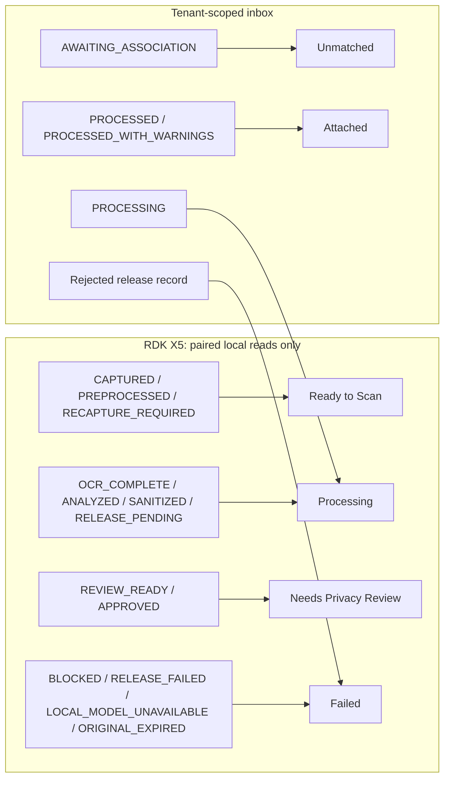

# Lloyd: Secure Intake workspace, document lifecycle queues, and multi-document cases

**Status:** Draft for implementation. **Date:** 2026-09-19. **Version:** 1.0-draft.
**Scope:** The operator-facing intake workspace (`Ready to Scan`, `Processing`, `Needs Privacy Review`, `Unmatched`, `Attached`, `Failed`), the enumeration and lifecycle data it requires from the gateway and backend, and the case↔document data model that replaces the singular `CaseDetail.intakeDocumentId`. This document describes required future behavior; it does not claim these capabilities exist today.

## 1. Relationship to the existing TDDs

`Lloyd_Edge_Cloud_TDD_v2.md` owns the edge/cloud responsibility split, the local classifier and semantic detector, hint generation, the v2 release envelope, the per-intake state machine, and the backend inbox. `Federato_RiskGraph_TDD.md` owns deterministic appetite evaluation and verified-fact provenance. **Neither is restated or amended here.** Both remain authoritative; where this document needs a behavior they already specify, it cites the section rather than redefining it.

This document covers the layer neither addresses: turning per-intake state into a **queryable, operator-owned work queue across two trust domains**, and letting a case hold more than one document. Those are the parts that case-scoped intake (`/cases/:id/intake`, shipped) deliberately left out.

Non-goals, deferred to the cited owners or to later work: image and table release (TDD v2 §5.3 limitations), extraction reconciliation across multiple documents of the same type (§7.2), automatic case association (§5.4 prohibits it), retention policy changes (§9), and multi-device fleet administration.

## 2. Baseline: what exists, and the six gaps

Evidence is the working tree at `/Users/yash/Documents/lloyd`, which contains substantial uncommitted v2 work. Record the source commit and dirty-tree patch hash before implementation.

| Capability | Status | Evidence |
|---|---|---|
| Per-intake device state machine, 14 states, revision invalidation | Implemented | `gateway/v2.py` (`transition`, `invalidate`) |
| Local document classification and semantic detection | Implemented | `gateway/inference.py`, `scripts/train-edge-classifier.py`, `docs/edge-v2/baseline.json` |
| Sanitized match-hint generation | Implemented | `gateway/hints.py`, `build_hints` called at `SANITIZED` |
| v2 envelope, dual signatures, independent backend verification | Implemented | `packages/contracts/src/intake-v2.ts` (`verifyV2`) |
| Backend inbox, idempotency, supersede, audit, association | Implemented | `packages/integrations/src/intakes.ts` (`IntakeInbox`) |
| Ranked case candidates from hints only | Implemented | `rankCandidates` (state 3, year 2, TIV bucket 2, LOB 1) |
| Device capture/review/approve UI | Implemented | `components/intake/IntakeV2View.tsx` |
| Backend inbox UI with association | Implemented | `components/intake/IntakeInboxView.tsx` |

Six gaps block the requested workspace:

1. **Device-side intakes cannot be enumerated.** `v2.py` exposes only `GET /v2/intakes/{id}/status` and `/review`; there is no list route, and `LocalStore` has no index (only `purge_expired` globs `*.enc`). `IntakeV2View` holds the intake id in React state, so a page reload orphans in-flight work with no way to find it again. Four of the six tabs describe device-side states and therefore have **no data source at all**.
2. **No tab taxonomy.** `GET /api/intakes` already filters by the four backend statuses (`AWAITING_ASSOCIATION`, `PROCESSING`, `PROCESSED`, `PROCESSED_WITH_WARNINGS`), but those four plus the fourteen device stages must project onto six operator queues. No mapping exists, no counts, and no rule that an item appears in exactly one queue.
3. **A case cannot hold two documents.** `CaseDetail.intakeDocumentId` is an optional single string (`lib/api/types.ts`), populated only by `MockLloydApi`; the backend never returns it. The inbox indexes intakes globally (`intake_index:all`) with no by-case index and no `GET /api/cases/:id/documents`. A second scan overwrites the first in the UI and is invisible from the case in live mode.
4. **`Needs Privacy Review` is not a state.** Every intake reaches `REVIEW_READY`, which conflates routine approval with genuine privacy risk. Nothing distinguishes "classifier abstained and the semantic detector found unlabeled identifiers" from "clean two-page inspection report".
5. **Failure has no home.** `BLOCKED`, `RELEASE_FAILED`, `LOCAL_MODEL_UNAVAILABLE`, `RECAPTURE_REQUIRED` and `ORIGINAL_EXPIRED` are reachable and persisted on the device but unqueryable. Rejected releases — `verifyV2` codes such as `BAD_SIGNATURE` and `DEVICE_DENIED`, plus `IntakeInbox`'s `INTAKE_DIGEST_CONFLICT` and `STALE_REVISION` — return an HTTP error and are persisted **nowhere**: the gateway keeps a 40-character `releaseError` locally and the backend keeps nothing.
6. **`Unmatched` has no memory.** `rankCandidates` runs on demand and its output is discarded, contrary to TDD v2 §7.1 ("Save candidate ranks"). There is no ageing policy, and `sufficientHints: false` is not distinguished from "ranked but nothing matched".

## 3. One queue over two trust domains

The device and the backend are separate origins with separate credentials. The gateway holds local pairing and reviewer tokens and may only be reached by a locally paired browser for privileged reads; the backend holds tenant-scoped reviewer authorization. **The browser is the only component that legitimately sees both**, so the merged queue is assembled client-side. A hosted server must never proxy device review or preview data (TDD v2 §4, §8); `EdgeV2Client` already enforces this by refusing `/review`, `/preview` and `/preview/stream` over the `proxy` transport.

Consequences the workspace must respect:

- Device counts require pairing. When the browser is unpaired or the gateway is unreachable, device-owned tabs must render an explicit **unpaired** state naming the missing capability. Rendering `0` is a correctness bug: it asserts there is no local work when the truth is unknown.
- The two domains fail independently. A backend outage must not hide local work awaiting approval, and vice versa. Each tab records which domain answered.
- Identity is shared but not authoritative in both places. `intakeId` is minted on the device and carried in the signed manifest; the backend record is keyed by the same value. The workspace joins on `intakeId` and must tolerate an item existing in one domain only — a released-but-rejected intake exists on the device and not in the inbox.



## 4. Tab taxonomy

Tabs are a **projection**, not new state. No state is invented on the device or the backend to serve a tab, and every item appears in exactly one tab so that counts sum to the total. Membership is defined by **who must act next**.

| Tab | Membership | Owner | Primary action |
|---|---|---|---|
| Ready to Scan | Device `CAPTURED`, `PREPROCESSED`, `RECAPTURE_REQUIRED`; plus the idle "start a scan" affordance | Operator | Capture or upload another page; analyze |
| Processing | Device `OCR_COMPLETE`, `ANALYZED`, `SANITIZED`, `RELEASE_PENDING`; backend `PROCESSING` | Machine | None; show which stage and which domain |
| Needs Privacy Review | Device `REVIEW_READY`, `APPROVED` | Reviewer | Inspect sanitized blocks, add redactions, approve, release |
| Unmatched | Backend `AWAITING_ASSOCIATION` | Reviewer | Confirm a ranked candidate or enter a case id |
| Attached | Backend `PROCESSED`, `PROCESSED_WITH_WARNINGS` | None; warnings are retryable | Open the case; retry a failed provider |
| Failed | Device `BLOCKED`, `RELEASE_FAILED`, `LOCAL_MODEL_UNAVAILABLE`, `ORIGINAL_EXPIRED`; backend rejection records | Operator or administrator | Per §7 |

Three membership decisions, stated explicitly because they are arguable:

- `RECAPTURE_REQUIRED` is **Ready to Scan**, not Failed. Quality rejection is the normal capture loop, and the action is "photograph the page again" into the same session.
- `PROCESSED_WITH_WARNINGS` is **Attached**, not Failed. The document is attached and the case is affected; an unavailable provider is a retryable warning on an attached document, and hiding it in Failed would understate what the case already contains.
- `APPROVED` is **Needs Privacy Review**, not Processing. Release is an explicit operator action in the current gateway, so an approved-but-unreleased intake is waiting on a human, not a machine. It must be visually distinct from unreviewed items and must show the approval expiry, since expiry bumps the revision and returns it to `REVIEW_READY` (`v2.py` release handler).

`Attached` additionally distinguishes **accepted by backend** from **all cloud processing completed** (TDD v2 §8); they are separate columns, never one "done" badge.

## 5. Device enumeration

### 5.1 Route

```
GET /v2/intakes?stage=<Stage>&limit=<1..100>   -> { items: IntakeSummary[], total: number }
```

`IntakeSummary` is bounded metadata only: `intakeId`, `documentId`, `revision`, `stage`, `caseId`, `pageCount`, `quality.status` and `quality.reasons`, `classification.status/documentType/confidence/calibration/modelId`, `matchHints`, `reviewRisk` (§6), `updatedAt`, `retentionUntil`, `originalDeleted`. It carries **no** sanitized text, OCR, boxes, token map, page bytes, or hashes of originals. Reusing the existing `status()` payload is acceptable; adding artifacts to it is not.

Stage metadata still reveals scanning activity, so the route requires the local pairing token like every other v2 route. Because it contains no document content, it may cross the same-origin proxy so a hosted workspace can show counts, while `/review` and `/preview` remain direct-pairing-only.

Note how that permission is granted: `lib/edge-proxy.ts` denies by last path segment (`review`, `preview`, `preview/stream`), so the proxy is **fail-open for new routes** — a list route is relayed with no code change at all. Leaving it relayed must therefore be a recorded decision rather than an accident, and any future route that carries sanitized content has to be added to `PRIVILEGED_SUFFIXES` on both sides at the moment it is introduced. Converting the denylist to an allowlist is the safer structure and should be considered as part of step 1.

### 5.2 Index

`LocalStore` gains an encrypted index (`index.enc`) written in the same atomic fsync pattern as records, holding one summary row per intake. Requirements:

- Rebuildable. A missing or undecryptable index is reconstructed by globbing `*.enc`, exactly as `purge_expired` already does, and the rebuild is logged as a bounded event.
- Consistent with retention. `delete_original` drops `pages`, `ocr`, `tokenMap` and `rawDetections`; the index row must follow the record to `ORIGINAL_EXPIRED` rather than continuing to advertise a reviewable intake.
- Never a second source of truth. The record is authoritative; a list row that disagrees is repaired on read, and a row whose record is absent is dropped.
- Written inside the existing `lock` on every `transition`, so a crash cannot leave a row describing a stage the record never reached.

### 5.3 Reload recovery

The workspace resolves "my in-flight intake" by listing, not by remembering. `IntakeV2View` takes the intake id from the route or from the list, so a reload, a second browser tab, or a shift change all converge on the same device state. Pairing tokens stay in `sessionStorage` (unchanged); intake identity does not belong there.

## 6. `Needs Privacy Review` as a computed risk flag

Approval remains mandatory for **every** release (TDD v2 §5.5). The flag orders the queue and tells the reviewer where to look; it never adds or removes an approval requirement, and a model cannot clear it.

`reviewRisk` is computed deterministically on the device when the intake reaches `SANITIZED`, stored on the record, and included in the summary and the signed manifest's existing fields where already representable:

| Reason code | Trigger |
|---|---|
| `CLASSIFIER_ABSTAINED` | `classification.status == "ABSTAINED"` |
| `LOW_CLASSIFIER_CONFIDENCE` | `confidence` below the versioned policy threshold |
| `SEMANTIC_ONLY_DETECTIONS` | Semantic spans with no overlapping deterministic span: the model found identifiers the patterns missed |
| `QUALITY_REVIEW` | `quality.status == "REVIEW"` |
| `HEAVY_REDACTION` | Redacted share of blocks above the policy threshold; the derivative may no longer be useful evidence (TDD v2 safe-data-retention gate) |
| `INSUFFICIENT_HINTS` | Hints would not rank candidates, so the release would land in `Unmatched`; fixable before release |

`calibration == "UNCALIBRATED"` is displayed but is **not** a trigger: it is currently always true, so flagging on it would flag everything and train reviewers to ignore the signal. Thresholds live in the versioned quality/privacy policy and must be calibrated on captured pages, not guessed.

## 7. Failure and retry semantics

| State | Cause | Allowed action | Idempotency |
|---|---|---|---|
| `RELEASE_FAILED` (`TRANSPORT`) | Backend unreachable or 5xx | Retry the **same approved envelope** | Backend dedupes on `(tenant, device, intake, revision)` + digest and returns the stored receipt |
| `RELEASE_FAILED` (digest conflict) | Backend holds a different digest for this revision | Start a new intake; the released revision is immutable | Never re-sign; record the conflict reason |
| Approval expired | `expiresAt` passed before release | None; the gateway already bumps the revision back to `REVIEW_READY` | Not a failure state, and must not appear in Failed |
| `BLOCKED` | Layout limit exceeded, detector exception | Split the document or recapture | No release path exists |
| `LOCAL_MODEL_UNAVAILABLE` | Missing or failed classifier/detector | Restore the model bundle; a labeled degraded path may capture but not release | `verifyV2` rejects `MODEL_UNAVAILABLE`, so release cannot succeed regardless |
| `ORIGINAL_EXPIRED` before approval | Retention elapsed | None; terminal. Audit metadata is retained | — |
| Backend rejection | `verifyV2` failure: signature, device, reviewer, quality, destination, provenance | Administrator action depends on the code | New persisted record, §7.1 |

### 7.1 Rejection records

The backend must persist a bounded rejection record so `Failed` has a source of truth on the cloud side: `{ at, tenantId, deviceId, intakeId, revision, identity, code }`, where `code` is the existing `verifyV2` failure code. It stores **no** rejected content, no signatures, and no artifact text — a suspected leak is never uploaded for debugging (TDD v2 §6). Rejections are listable by tenant and joined to device rows by `intakeId`.

## 8. Multi-document cases

### 8.1 Identity rule

This is the decision the singular field forced and never answered:

- A **new intake** attached to a case **appends** a document.
- A **new revision of the same intake** **supersedes** the previous one. `IntakeInbox.accept` already rejects stale revisions and records `supersedes: { revision, digest }`; the case therefore shows one row per `intakeId`, at its highest accepted revision, with superseded revisions visible in history.

Document identity is `(tenantId, intakeId)`. `documentId` is stable across revisions of one intake and is not unique within a case.

### 8.2 Shapes

```typescript
interface CaseDocument {
  intakeId: string;
  documentId: string;
  revision: number;
  digest: string;
  documentType: DocumentType;       // local classification, unverified
  providerDocumentType?: DocumentType; // Gemini confirmation; disagreements preserved
  pageCount: number;
  receivedAt: string;
  attachedAt: string;
  attachedBy: string;               // reviewer id
  associationSource: "PRESELECTED" | "REVIEWER" | "CARRIED_FORWARD";
  status: IntakeStatus;
  supersedesRevision?: number;
}
```

`CaseDetail` gains `documents: CaseDocument[]`, ordered newest-first by `receivedAt`. `intakeDocumentId` becomes a derived read-only alias for `documents[0]?.documentId` for exactly one release, is marked deprecated in `lib/api/types.ts`, and is then deleted. Because only `MockLloydApi` ever populated it, the migration risk is confined to the demo fixtures and `CaseWorkspace`.

### 8.3 Backend

- Maintain a by-case index (`intake_case_index:<caseId>` → `intakeId[]`) inside `IntakeInbox.save`, `accept` and `associate`. Re-association must **remove** the intake from the previous case's index in the same operation that adds it to the new one; a document must never appear under two cases.
- Add `GET /api/cases/:id/documents`, authorized identically to the case itself and filtered by reviewer case access (`reviewerMayAccess`).
- Include a bounded `documents` array in `GET /api/cases/:id` so the workspace does not need a second round trip per case.
- Re-association remains audited and never rewrites the released manifest (TDD v2 §7.1). Removing a document from a case is a distinct audited action, not an association edit, and it does not delete the intake record.

### 8.4 Underwriting consequences

Multiple documents of the same type are now expressible, so the deterministic engine must not be handed silently overwritten facts. Two loss runs for one case are two evidence sources with separate provenance; reconciliation and promotion stay exactly where TDD v2 and `Federato_RiskGraph_TDD.md` put them, and no document attachment may promote a candidate fact on its own. `CaseWorkspace` shows documents as an evidence list with type, page count, revision and attribution, not as a single link.

### 8.5 Frontend contract

```typescript
// Workspace queue, merged client-side across both domains.
type IntakeTab = "ready" | "processing" | "privacy_review" | "unmatched" | "attached" | "failed";
interface IntakeWorkItem {
  intakeId: string;
  origin: "device" | "backend" | "both";
  tab: IntakeTab;
  stage?: V2Stage;          // device rows
  status?: IntakeStatus;    // backend rows
  reviewRisk: string[];
  caseId: string | null;
  documentType: DocumentType;
  updatedAt: string;
}
interface LloydApi {
  listIntakeWork(filter?: { tab?: IntakeTab }): Promise<{ items: IntakeWorkItem[]; counts: Record<IntakeTab, number | null>; deviceReachable: boolean }>;
  getCaseDocuments(caseId: string): Promise<CaseDocument[]>;
  retryIntakeRelease(intakeId: string): Promise<IntakeWorkItem>;
  retryIntakeProcessing(intakeId: string): Promise<IntakeWorkItem>;
}
```

`counts` is `Record<IntakeTab, number | null>`; `null` means "this domain did not answer", which the UI renders as unknown rather than zero (§3). `MockLloydApi` implements the same surface so the demo and tests exercise all six tabs, including Failed, without a board attached.

## 9. Acceptance gates

Proposed release gates, not measurements already taken.

| Gate | Required evidence |
|---|---|
| Enumeration privacy | Byte-level assertion that no list response contains sanitized text, OCR, boxes, token maps or original hashes, including under `?stage=` filters and after `delete_original` |
| Index durability | Kill -9 mid-`transition`, disk-full, and index deletion each leave a rebuildable index whose rows match the records; no row survives its record |
| Partition invariant | Property test over all 14 device stages × 4 backend statuses: every item lands in exactly one tab and counts sum to the total |
| Domain isolation | Gateway unreachable shows unknown device counts and intact backend tabs; backend unreachable shows intact device tabs; neither renders a false zero |
| Proxy boundary | Network capture proves `/review`, `/preview` and `/preview/stream` remain refused over the proxy after the list route is added |
| Risk flag quality | On the held-out corpus, every page with a seeded unlabeled identifier raises `SEMANTIC_ONLY_DETECTIONS`; clean pages flag at a rate low enough to keep the queue meaningful, reported with the denominator |
| Retry correctness | Transport retry of the same envelope yields one persisted intake and one set of provider calls; digest conflict cannot be retried; expired approval never appears in Failed |
| Rejection visibility | Each `verifyV2` failure code produces exactly one rejection record containing no content, joinable to the device row |
| Multi-document model | Two distinct intakes on one case append; a second revision of one intake supersedes; re-association moves the document and leaves no trace in the old case's index |
| No silent fact overwrite | Attaching a second document of the same type does not change any verified fact or appetite outcome without the existing evidence-acceptance path; existing appetite tests pass unchanged |
| Reload recovery | Capturing, reloading the browser, and reopening the workspace returns the operator to the same in-flight intake and revision |

## 10. Implementation sequence

1. **Device enumeration.** `LocalStore` index with rebuild, `GET /v2/intakes`, health capability entry. Exit: enumeration privacy and index durability gates pass; a reload recovers an in-flight intake.
2. **Lifecycle vocabulary.** `reviewRisk` computation and policy thresholds; backend rejection records; by-case index. Exit: risk flag and rejection visibility gates pass.
3. **Merged queue and tabs.** `listIntakeWork` in both adapters, the six-tab workspace replacing the current two-pane inbox, unknown-count rendering, per-tab actions and retries. Exit: partition invariant, domain isolation and retry gates pass.
4. **Multi-document cases.** `CaseDocument`, `documents` on `CaseDetail`, `GET /api/cases/:id/documents`, `CaseWorkspace` document list, deprecation of `intakeDocumentId`. Exit: multi-document and no-silent-overwrite gates pass.
5. **Remove the alias.** Delete `intakeDocumentId` and the mock behavior that sets it once no caller reads it.

Steps 1 and 2 are independently useful and unblock the rest; step 4 is the only one that touches underwriting-visible surfaces and should land behind the existing demo fixtures first.

## 11. Decisions to resolve

- Confirm that the list route may cross the same-origin proxy (§5.1). If the product owner declines, hosted deployments lose device counts entirely and the workspace must say so rather than degrade silently.
- Set the `LOW_CLASSIFIER_CONFIDENCE` and `HEAVY_REDACTION` thresholds from the held-out corpus; until then the flag is labeled provisional in the UI.
- Decide whether an operator may remove an attached document from a case, or only re-associate it, and who is authorized.
- Decide the `Unmatched` ageing policy: how long an unassociated accepted release waits before it is escalated, and whether it ever expires given that the device original may already be gone.
- Confirm whether persisted candidate ranks (TDD v2 §7.1) are recomputed on case-data change or frozen at release; frozen ranks age badly, recomputed ranks complicate the audit trail.
