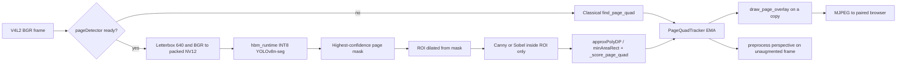

# Lloyd: on-device page detector (YOLOv8n-seg on RDK X5 BPU)

**Status:** Draft for implementation. **Date:** 2026-09-19. **Version:** 1.0-draft.  
**Scope:** Replace “largest bright blob” page finding with a local, BPU-accelerated page segmenter plus classical quadrilateral fit, so live preview and capture lock onto a held document rather than ceiling lights. This document describes required future behavior; it does not claim the BPU path is deployed.

## 1. Relationship to existing TDDs

`Lloyd_Edge_Cloud_TDD_v2.md` owns the edge/cloud split, digest-pinned local models, preview as a privileged local-only stream, and the rule that CPU inference is the correctness baseline while BPU acceleration is optional and must preserve tested output semantics (§4, §5.1, §9). `Lloyd_Intake_Workspace_TDD.md` owns the operator workspace and the rule that `/preview/stream` is never proxied. `Federato_RiskGraph_TDD.md` owns appetite evaluation.

**None of those documents is restated or amended here.** This TDD covers one missing capability they already require: reliable page-boundary detection on the RDK X5 camera.

| Existing owner | What this TDD consumes | What this TDD must not change |
|---|---|---|
| TDD v2 §4 | Raw preview stays on-device; overlay is never a cloud input | Privileged route list, pairing, `Via` denial |
| TDD v2 §5.1 | Perspective correction, `pageCorners`, quality reasons | OCR layout contract, quality status enum |
| TDD v2 §5.2 | `DocumentClassifier` (text) | Classifier labels, abstention, or artifact format |
| TDD v2 §9 | Offline bundle, SHA-256 pin, no runtime download | Bundle layout except a new `models.pageDetector` entry |
| Intake TDD §3 | Direct-paired MJPEG only | Workspace tabs, inbox, association |

**Name collision (mandatory):** `EDGE_DETECTOR_*` and `/health.capabilities.detector` already mean the spaCy NER semantic detector (`gateway/inference.py`). The page model is a third capability: `pageDetector`. Env, bundle keys, and health JSON must use that name. Reusing `detector` is a correctness bug.

## 2. Problem and decision

### 2.1 Observed failure

Live `/preview/stream` drew a yellow 4-gon spanning the top of the frame and the bottom of a held flyer. Root cause in `find_page_quad`: Canny + Otsu + `RETR_EXTERNAL`, then **the largest 4-corner contour wins**. Ceiling lights and the page are one bright blob; nested paper contours were discarded. A scoring pass (rectangularity, paper-pixel fraction, reject a top-border-spanning side) is now in `gateway/capture.py` and covers a synthetic ceiling+flyer fixture. That is the **CPU fallback**, not the target detector.

### 2.2 Options considered

| Option | Verdict | Why |
|---|---|---|
| Keep classical CV only | Fallback only | Cheap, but still fights lights/hands/clutter; no class “page vs not-page” |
| Ultralytics YOLOv8 via PyTorch on the X5 | Reject | 8× Cortex-A55, no `torch` in the gateway venv, fights 15 fps MJPEG + Tesseract; TDD v2 forbids runtime weight download |
| Sobel / Canny **then** YOLOv8 | Reject | YOLO is trained on RGB appearance. Edge maps make ceiling tiles look like pages. BPU samples expect packed NV12 camera frames, not 1-channel Sobel |
| Stock COCO `yolov8_seg` already on the board | Bootstrap only | Classes are `person`/`book`, not a held flyer; AABB/mask of `book` is not a page quad |
| **Custom YOLOv8n-seg (1 class `page`) → Horizon INT8 `.bin` on BPU → mask-to-quad** | **Adopt** | Board already has `hobot-dnn`, `yolov8_seg_640x640_nv12.bin`, and published YOLOv8n BPU rates ~140 FPS at 640. Overlay needs a perspective quad, which the mask plus existing `_score_page_quad` supplies |

Sobel/Canny remain **post**-YOLO, inside the predicted mask, to snap corners. They are not a network input.

### 2.3 Hardware baseline (SSH, 2026-09-20)

| Fact | Value |
|---|---|
| Board | D-Robotics RDK X5, 8× Cortex-A55, 6.9 GiB RAM |
| BPU runtime | `hobot-dnn` 3.0.4, `/opt/hobot` |
| Stock models | `/opt/hobot/model/x5/basic/yolov8_640x640_nv12.bin`, `yolov8_seg_640x640_nv12.bin` |
| Running gateway | `/opt/lloyd-edge-gateway`, systemd `lloyd-edge-gateway`, bind `127.0.0.1:8001` |
| Gateway vision | OpenCV in venv; **no** `ultralytics`, **no** `torch` |
| Preview | MJPEG `/preview/stream`, ~15 fps, JPEG quality 70, overlay `#FFD300` / 10% fill, never burned into capture |

## 3. Target pipeline



Invariants:

1. Detection runs only on the RDK. Frames, masks, and corners never leave the board except as the already-authorized local MJPEG.
2. Overlay is drawn on a **copy**. `OpenCVCamera.capture` and stored originals stay unannotated.
3. A missing, digest-mismatched, or failed BPU model reports `UNAVAILABLE` and uses classical CV. Classical CV is not reported as the neural detector.
4. The page detector has no tools, network, shell, or release capability.

## 4. Model

### 4.1 Architecture

- Family: **Ultralytics YOLOv8n-seg** (nano). Not v8s/m/x, not v11, not detect-only, not OBB, not pose.
- Input: **640×640**, the size Horizon samples and the stock X5 `yolov8_seg` `.bin` already use.
- Classes: exactly one, `page` (id 0). No COCO remnant classes in the exported head.
- Output used on device: instance mask (+ box/score for gating). The overlay is **not** the AABB.
- Weights license: record Ultralytics AGPL/enterprise status in the bundle `models.pageDetector.license`. If AGPL is unacceptable for the demo, stop before training and switch to a permissively licensed nano-seg alternative; do not ship unmarked weights.

Detect-only YOLOv8n is allowed only as a **temporary** BPU bring-up if seg compilation fails. It must still run mask-less quad fit inside the box, and it does not satisfy final acceptance (a box around paper+hand is the original product defect in another form).

### 4.2 Training (laptop / x86+CUDA, never on the X5)

Do not modify `forward`. Train with stock Ultralytics so `rdk_model_zoo` `export_monkey_patch.py` can export.

**Dataset (`datasets/page-seg/`, gitignored images, committed `data.yaml` + train script):**

| Split | Minimum | Content |
|---|---|---|
| Train | 200 labeled frames | Held flyers/letters at angles; desk pages; one-hand occlusion; ceiling lights; mixed rooms |
| Val | 40 | Same domains, no train overlap |
| Negatives | ≥30% of train | Empty room, ceiling-only, person with no paper, screens, tables |
| Board-real | ≥40 of train+val | Frames from **this** X5 camera (`EDGE_CAMERA_INDEX`), including the Dryft-flyer lighting |

Labels: YOLO-seg polygons around the paper sheet (not the printed yellow example border, not the hand). Clipped pages are still `page` if ≥50% of the sheet is visible.

Augmentations (Ultralytics defaults plus): mosaic off for the last 20 epochs; HSV moderate; rotation ±15°; scale 0.5–1.4; no random perspective so extreme warps do not invent non-planar “pages”.

Stop when val mask IoU ≥ 0.80 and a held-out **ceiling+flyer** set of ≥10 board frames has page IoU ≥ 0.72 (same gate as `test_page_quad_locks_onto_flyer_not_ceiling_lights`).

Artifact: `page-v1.pt` plus `page-v1-metrics.json` (epochs, IoU, images, git commit of the train script).

### 4.3 Export and BPU compile (x86 Linux, never on the X5)

Follow D-Robotics `rdk_model_zoo` `samples/vision/ultralytics_yolo/conversion` (RDK X5 branch):

1. `export_monkey_patch.py --pt page-v1.pt` → ONNX with the official head rewrite (Threshold/TopK, DFL, proto×coeff for seg).
2. Compile with `rdkx5-yolo-mapper` **or** OpenExplorer Docker `openexplorer/ai_toolchain_ubuntu_20_x5_cpu:v1.2.8` (`--shm-size=15g`). Do not install the compiler on the board.
3. `mapper.py --onnx page-v1.onnx --cal-images datasets/page-seg/calib --output-dir dist/page-detector --quantized int8`. Calibration: **20–50 JPEG/PNG from the X5 camera**, RGB scenes, not Sobel. Include ceiling and flyer frames.
4. Target name: `page-v1_bayese_640x640_nv12.bin`.
5. Check: `hb_model_info` / `hrt_model_exec model_info`; cosine vs ONNX ≥ 0.99 on a 10-image probe; `hrt_model_exec perf` on the board after copy.

Input protocol of the `.bin` is **packed NV12**. Training remains RGB/NCHW with `data_scale=1/255`. Runtime must convert BGR→NV12 the same way as `rdk_model_zoo` Python samples. A mismatched conversion is a silent accuracy bug.

If seg compile fails at O3, retry O2 then O1. If the mapper rejects the custom 1-class head, keep 1 class anyway and patch only export config — do not reintroduce 80 COCO classes.

## 5. On-device runtime

### 5.1 Module

New: `apps/edge-gateway/gateway/page_detect.py`.

```python
class PageDetector:
    def capabilities(self) -> dict: ...
    def infer(self, frame_bgr) -> PageDetection | None: ...
```

`PageDetection`: `{mask, boxXyxy, score, latencyMs, modelId, artifactDigest, backend}` where `backend` is `bpu` | `cpu` | `unavailable`.

Construction mirrors `LocalClassifier`: path + SHA-256. Mismatch or missing file → `ready: false`, `error` bounded, no exception on `/health`.

Backends, in order:

1. **`BpuYoloSeg`** (`hbm_runtime` / hobot-dnn): production on the X5.
2. **`CpuMaskFixture`**: tests and laptops. Loads a PNG mask or runs a tiny stub; **not** Ultralytics.
3. Missing → `infer` returns `None`; caller uses `find_page_quad`.

PyTorch and the `ultralytics` package **must not** appear in `apps/edge-gateway/pyproject.toml` or the board venv. Optional extra: `page-bpu` that imports `hbm_runtime` only if present.

### 5.2 Frame path

Preview is 15 fps. Budget for `annotate_preview_frame` on the X5, 640-wide working copy:

| Stage | Budget |
|---|---|
| Letterbox + NV12 | ≤ 8 ms |
| BPU forward YOLOv8n-seg | ≤ 15 ms (stock ~7 ms class; leave headroom) |
| Mask upsample + largest instance | ≤ 5 ms |
| Canny/quad inside ROI | ≤ 8 ms |
| Overlay + JPEG q70 | existing |
| **Total detect+fit** | **≤ 40 ms** so 15 fps still has slack |

If BPU latency exceeds 40 ms p95 on a 30-second preview, skip inference on alternate frames and hold `PageQuadTracker` (already holds 6 frames). Do not drop the MJPEG generator.

Capture/preprocess runs the same `detect_page` once per still (not 15 fps). Timeout 200 ms; then classical CV.

### 5.3 Mask to quad

1. Take the highest-score `page` instance with score ≥ `EDGE_PAGE_SCORE_MIN` (default 0.35, uncalibrated until a board sweep).
2. Resize mask to frame size. Morph close 5×5. Reject if area fraction ∉ `[0.06, 0.78]`.
3. Dilate ROI by 4% of min(h, w). **Inside that ROI only**, run Canny (and optionally Sobel magnitude as an extra edge map, OR-ed). Do not edge-detect the full frame.
4. Contours → `_contour_quads` → `_score_page_quad` as today. If scoring rejects all, fall back to `minAreaRect` of the mask if rectangularity ≥ 0.72.
5. Order corners with `_order_corners`. Feed `PageQuadTracker`.

Empty mask or score below threshold: no overlay (preview) / classical `find_page_quad` (capture). Never keep a stale ceiling quad because YOLO abstained for one frame beyond the tracker hold.

### 5.4 Integration points

| Call site | Behavior |
|---|---|
| `annotate_preview_frame` | `detector.infer` → fit → tracker → `draw_page_overlay` on a copy |
| `preprocess` | same fit for `pageCorners` / perspective; record `pageDetector` in quality metadata: `backend`, `modelId`, `score`, `latencyMs` |
| `/health` | `capabilities.pageDetector`: `ready`, `modelId`, `artifactDigest`, `runtimeVersion`, `backend`, `input`, `calibration`, `error` |
| Bundle | `models.pageDetector` + env `EDGE_PAGE_DETECTOR_PATH` / `EDGE_PAGE_DETECTOR_SHA256` |

Quality metadata must not include the mask bitmap or any image bytes.

## 6. Configuration

Add to `infra/edge/lloyd-edge.env.example` and `.env.example` (empty secrets):

```
EDGE_PAGE_DETECTOR_PATH=/opt/lloyd-edge/current/models/page-v1_bayese_640x640_nv12.bin
EDGE_PAGE_DETECTOR_SHA256=
EDGE_PAGE_DETECTOR_BACKEND=auto   # auto | bpu | cpu | off
EDGE_PAGE_SCORE_MIN=0.35
EDGE_PAGE_INPUT=640
```

`auto`: BPU if `hbm_runtime` loads the pinned `.bin`, else CPU fixture if a mask-debug path is set, else `off` (classical only). `off` is valid for boards without a page model; `/health` shows `ready: false`, not a fake COCO detector.

**Forbidden:** pointing `EDGE_PAGE_DETECTOR_PATH` at `/opt/hobot/model/x5/basic/yolov8_seg_640x640_nv12.bin` in a production `gateway.env`. That bin is COCO. It may be used in a **lab** `EDGE_PAGE_DETECTOR_BACKEND=bpu-lab` to prove NV12 I/O and latency only; lab mode must not draw overlay from COCO classes, or must map nothing (no `page` class).

## 7. Privacy, logging, overlay

- No page image, mask, or OCR text in `journalctl`. Log `intakeId` / bounded codes / `latencyMs` / `backend` only.
- Preview overlay colors stay `#FFD300` stroke and `#FFD300` at 10% fill (`PREVIEW_OVERLAY_BGR`, `PREVIEW_HIGHLIGHT_ALPHA`).
- Overlay still preview-only (TDD v2 §4). Capture bytes after this work must match capture bytes with `pageDetector=off` on the same frame.
- Calibration and train images are **raw PII-adjacent photos**. They stay off git, off the backend, and off any cloud trainer. Training is local or on an operator-controlled machine. Do not upload Dryft-flyer camera dumps to Ultralytics Hub or a public Roboflow workspace.

## 8. Tests and acceptance

CPU tests run in `apps/edge-gateway/tests/` without a BPU. BPU tests run on the X5 and are skipped elsewhere (`pytest.importorskip` / `@pytest.mark.board`).

### 8.1 Must pass on CPU (CI)

| Test | Gate |
|---|---|
| Existing overlay / ceiling-flyer / clipped-page / empty-desk | Still pass with detector `off` |
| `PageDetector` missing file or bad digest | `ready: false`, `infer` is `None`, classical path used |
| Fixture mask of a trapezoid page in a bright ceiling scene | Fitted quad IoU vs label ≥ 0.72 |
| Overlay copy-safety | Capture frame bytes unchanged |
| `/health` includes `pageDetector` and does **not** overwrite `detector` (NER) |
| Bundle `--page-detector` writes `models.pageDetector` and the two env keys |
| Sobel-full-frame is not called in the BPU path (unit: ROI mask area < 50% of frame on the ceiling+flyer fixture) |

### 8.2 Must pass on the X5 (manual then scripted)

| Gate | Measure |
|---|---|
| NV12 round-trip | `hb_model_info` input is NV12; a known PNG yields a nonempty `page` mask |
| Latency | p95 `infer` ≤ 40 ms over 200 preview frames while MJPEG stays ≥ 12 fps |
| Ceiling+flyer | Live Dryft-style hold: overlay IoU vs hand-labeled quad ≥ 0.72 on 10 saved frames; **zero** frames where a side spans the top image border |
| Empty room | No overlay for ≥ 8/10 frames |
| Digest pin | Wrong `EDGE_PAGE_DETECTOR_SHA256` → `UNAVAILABLE`, classical fallback, gateway still serves preview |
| Capture identity | `sha256(captured original)` with overlay running equals capture with preview unused |
| Memory | Preview + detector RSS delta < 400 MiB over a 30 s stream (board has ~6.5 GiB free today; do not regress into swap-none OOM) |

### 8.3 Explicit non-acceptance

- Ultralytics `YOLO().predict` on the board.
- Full-frame Sobel/Canny as YOLO input.
- Using stock COCO weights as the page model in `gateway.env`.
- Reporting classical CV as `backend: "bpu"`.
- Burning the yellow overlay into `preprocess` output.

## 9. Bundle and deploy

`scripts/build-edge-bundle.py build` gains `--page-detector path.bin`. Manifest:

```json
"pageDetector": {
  "path": "models/page-v1_bayese_640x640_nv12.bin",
  "sha256": "<file digest>",
  "modelId": "page-v1",
  "input": "640x640_nv12",
  "task": "seg",
  "classes": ["page"],
  "license": "<recorded>",
  "env": {
    "EDGE_PAGE_DETECTOR_PATH": "models/page-v1_bayese_640x640_nv12.bin",
    "EDGE_PAGE_DETECTOR_SHA256": "<file digest>"
  }
}
```

Install remains TDD v2 §9: copy bundle to `/opt/lloyd-edge/<version>`, pin `current`, fill `gateway.env` from the manifest env block, `systemctl restart lloyd-edge-gateway`. Dev boards currently run `/opt/lloyd-edge-gateway`; the same two env vars apply. Do not `rsync` from `~/.codex/worktrees/...` (`gateway.sh` is stale).

Rollback: previous bundle + previous `.bin` digest. A new `.pt` without a new `.bin` must not be copied to the board.

## 10. Implementation sequence

Work in this order. Each step has a stoppable deliverable. Do not start step N+1 if N’s gate failed.

### Step 0 — Contract (half day)

- Add `pageDetector` to `/health` as `ready: false` when unset.
- Reserve env keys. Do not load COCO.
- Keep classical `find_page_quad` as the only live path.

**Gate:** existing `test_v2.py` green; health schema test for the new key.

### Step 1 — Mask-to-quad on CPU (half day)

- Extract `fit_page_quad_from_mask(gray, mask)`.
- Wire `annotate_preview_frame` / `preprocess` to: if a detector returned a mask, fit; else classical.
- Fixture tests: ceiling+flyer mask → flyer quad; empty mask → no overlay.

**Gate:** IoU ≥ 0.72 on the synthetic fixture; overlay still copy-safe.

### Step 2 — Dataset and train (1–2 days, laptop)

- Capture ≥40 X5 frames (flyer, ceiling, empty, desk). Label polygons.
- Train YOLOv8n-seg 1-class. Save `page-v1.pt` + metrics locally (not git LFS unless agreed).

**Gate:** val mask IoU ≥ 0.80; 10 board photos ≥ 0.72 vs labels **in Ultralytics val**, before any BPU compile.

### Step 3 — ONNX + INT8 `.bin` (half–1 day, x86)

- `export_monkey_patch.py` then `mapper.py` with 20–50 X5 calib images.
- Record mapper log, `hb_model_info`, cosine check.

**Gate:** `.bin` exists; name `*_nv12.bin`; 1 class; cosine ≥ 0.99 on probe.

### Step 4 — BPU adapter (1 day)

- `BpuYoloSeg` using the same pre/post as `rdk_model_zoo` Python seg runtime (letterbox, packed NV12, proto×coeff, NMS).
- Lab mode may load stock `yolov8_seg` **only** to print latency, not overlay.

**Gate:** on-board `infer` p95 ≤ 40 ms; a flyer photo returns a mask covering the paper, not the ceiling.

### Step 5 — Live preview + capture (half day)

- `PageDetector` into `create_app` / `Settings`.
- Preview 15 fps with tracker; capture uses the same detector once.
- Fallback on `off` / bad digest.

**Gate:** §8.2 live list. Dryft hold no longer produces a top-border-spanning triangle.

### Step 6 — Bundle pin (half day)

- `--page-detector` in `build-edge-bundle.py`.
- Env example + `infra/edge/README.md` one paragraph.
- Restart policy: digest mismatch = fallback, not crash.

**Gate:** `bundle:edge verify` includes the `.bin`; wrong sha256 → `pageDetector.ready false`.

## 11. Non-goals

- Document-type classification (already `LocalClassifier`).
- Layout/table detection, signature boxes, face boxes.
- Cloud or laptop-side inference of live preview.
- Training on the X5.
- YOLOv8s/m/x, YOLO11, or OBB unless step 4 cannot compile n-seg (then write an amendment; do not silently swap).
- Changing overlay colors, MJPEG privilege, or capture immutability.
- Replacing Tesseract or the text classifier with this model.

## 12. Risks

| Risk | Mitigation |
|---|---|
| Custom 1-class seg fails Horizon mapper | Keep n-seg architecture; fall back to n-detect + ROI quad fit; amendment required for final acceptance |
| AGPL on Ultralytics weights | Record license; use only if the demo allows; otherwise swap nano-seg source before train |
| NV12 vs RGB mismatch | Copy conversion from rdk_model_zoo; golden PNG on board |
| BPU contention with future models | Page detect owns preview; classifier stays text and does not share the preview loop |
| Overfit to one flyer | ≥30% negatives; multiple document types and rooms in train |
| `gateway.sh` deploys the wrong tree | Delete or retarget that script as part of step 6 |

## 13. Done when

The paired browser’s live preview boxes the held page, not the lights, at ≥12 fps on the X5, using a digest-pinned YOLOv8n-seg `.bin` on the BPU, with classical CV only as a named fallback, capture originals unpainted, and `/health.capabilities.pageDetector.ready === true` with a matching SHA-256.
